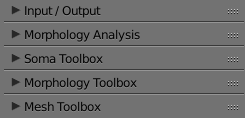

# NeuroMorphoVis


## Summary
NeuroMorphoVis is an interactive, extensible and cross-platform framework for building, 
visualizing and analyzing digital reconstructions of neuronal morphology skeletons extracted 
from microscopy stacks. The framework is capable of detecting and repairing tracing artifacts, 
allowing the generation of high fidelity surface meshes and high resolution volumetric models 
for simulation and in silico imaging studies.


## Dependencies 
The framework is mainly based on Blender. The current release uses the API of Blender 2.78b or 2.78c. Blender is a free software and can be downloaded from this [page](http://download.blender.org/release/). Blender comes with an LGPL license. 
There are other optional dependecies that are specific to users from [Blue Brain Project](https://github.com/BlueBrain). These dependencies are:
+ [HDF5 Python Bindings](https://www.h5py.org)
+ [Blue Brain Brion](https://github.com/BlueBrain/Brion) 


## Interfaces
NeuroMorphoVis is primarily designed as a plug-in in Blender. It comes with a user-friendly GUI and also with a rich set of command line options. Moreover, the tool is configurable via input configuration files making it possible to link it to web interface or using it on massively parallel visualization clusters for batch production.   

### GUI


### Command Line Options

### Configuration Files 
Users can easily configure _NeuroMorphoVis_ via editable configuration files. Instructions to write and use configurations files are available in this [page](docs/user/modules/configurations/configurations.md).  


### Modules 
NeuroMorphoVis comes with four principal modules for 
+ Data handling,
+ Simulation of three-dimensional somata profiles,
+ Building, repair and analysis of morphological skeletons,
+ Creation of piecewise-watertight polygonal surface meshes.

### Panels / Toolboxes
NeuroMorphoVis has five panels   
+ Input / Output, for setting paths to input morphologies and output directories. 
+ Morphology Analysis, for selecting the filters that will be applied on the morphology skeleton to analyze it.
+ Soma Toolbox, for setting the parameters for somata reconstruction.
+ Morphology Toolbox, for setting parameters that control the shape of the reconstructed morphology skeleton for visualization and visual analytics.
+ Mesh Toolbox, for setting the parameters to create meshes from morphology skeletons.

<p align="center">
  
</p>


### Installation 
[Installation](info/installation/install.md)

### Videos 

#### Neuronal Soma Reconstruction 
[](https://www.youtube.com/watch?v=v02HogkFODU)

#### Neuronal Morphology Visualization 
[](https://www.youtube.com/watch?v=74PGirMx3ks&t=102s)

#### Neuronal Mesh Reconstruction 
[](https://www.youtube.com/watch?v=oxCKwrZSV98&t=130s)

## Publication & Citation 
If you use NeuroMorphoVis for your research, media design or other purposes, please cite our paper [NeuroMorphoVis: a collaborative framework for analysis and visualization of neuronal morphology skeletons reconstructed from microscopy stacks](https://academic.oup.com/bioinformatics/article/34/13/i574/5045775) using the following entry:

```
@article{abdellah2018neuromorphovis,
  title={NeuroMorphoVis: a collaborative framework for analysis and visualization of neuronal morphology 
  skeletons reconstructed from microscopy stacks},
  author={Abdellah, Marwan and Hernando, Juan and Eilemann, Stefan and Lapere, Samuel and Antille, 
  Nicolas and Markram, Henry and Sch{\"u}rmann, Felix},
  journal={Bioinformatics},
  volume={34},
  number={13},
  pages={i574--i582},
  year={2018},
  publisher={Oxford University Press}
}
```

The core algorithms of the soma and mesh reconstruction modules are described in this paper [Reconstruction and visualization of large-scale volumetric models of neocortical circuits for physically-plausible in silico optical studies](https://bmcbioinformatics.biomedcentral.com/articles/10.1186/s12859-017-1788-4)

```
@article{abdellah2017reconstruction,
  title={Reconstruction and visualization of large-scale volumetric models of neocortical circuits 
  for physically-plausible in silico optical studies},
  author={Abdellah, Marwan and Hernando, Juan and Antille, Nicolas and Eilemann, Stefan and 
  Markram, Henry and Sch{\"u}rmann, Felix},
  journal={BMC bioinformatics},
  volume={18},
  number={10},
  pages={402},
  year={2017},
  publisher={BioMed Central}
}
```