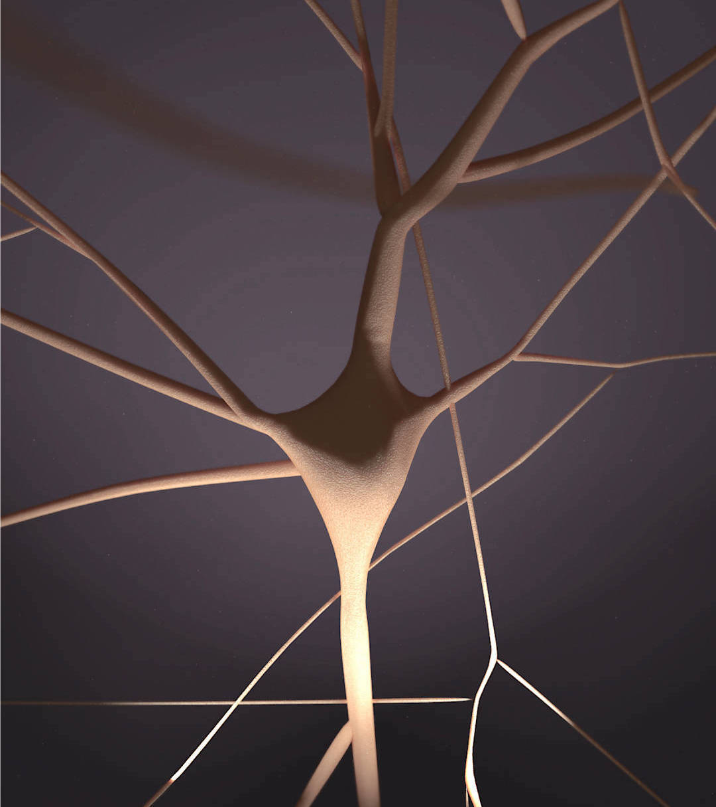
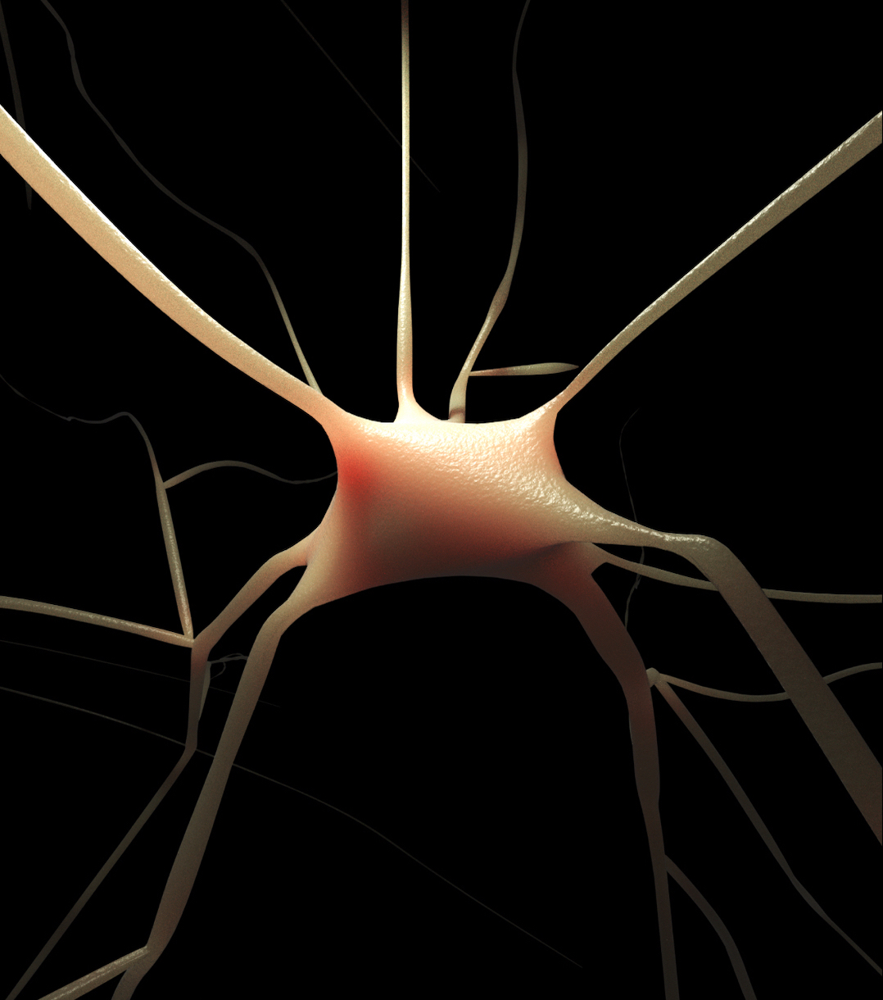
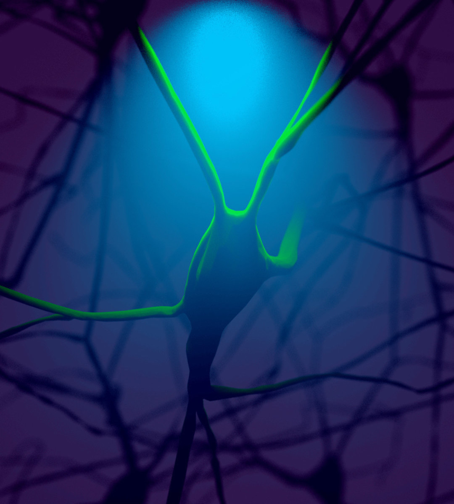
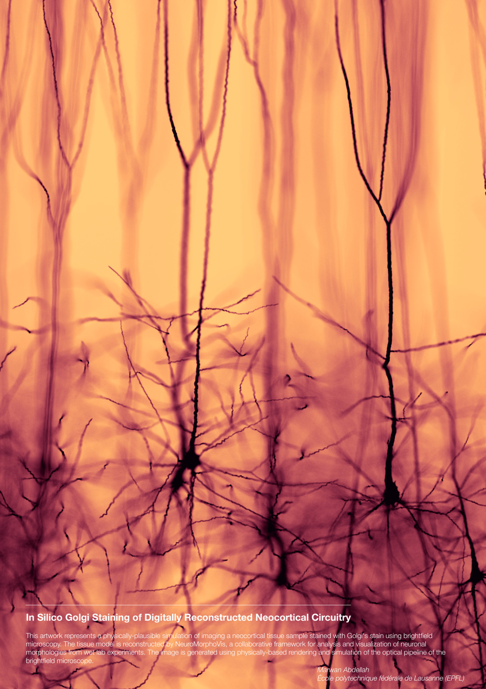
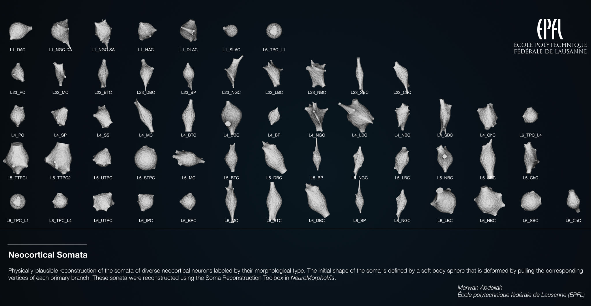

# NeuroMorphoVis


## Introduction

_NeuroMorphoVis_ is an interactive, extensible and cross-platform framework for building, visualizing and analyzing digital reconstructions of neuronal morphology skeletons extracted from microscopy stacks. The framework is capable of detecting and repairing several tracing artifacts, allowing the generation of high fidelity surface meshes and high resolution volumetric models for simulation and _in silico_ imaging studies. 

## Features

_NeuroMorphoVis_ provides four major toolboxes that can be used for 

+ Automated analysis of neuronal morphology skeletons that are digitally reconstructed from optical microscopy stacks. 
+ An easy context to load broken morphology skeletons and repair them manually. 
+ Sketching and building three-dimensional representations of the morphology skeletons using various methods.
+ Automated reconstruction of accurate three-dimensional somata profiles, even with classical morphology skeletons that do not have any three-dimensional data of their somata. This approach uses the physics engine of Blender based on Hooke's law and mass spring models.
+ Automated reconstruction of polygonal mesh models that represent the membranes of the neuronal morphologies based on the piecewise meshing method presented by [Abdellah et al., 2017](https://bmcbioinformatics.biomedcentral.com/articles/10.1186/s12859-017-1788-4).
+ Automated generation of high quality media for scientific documents and publications using different shading styles and materials. 
+ Multiple interfaces: user-friendly graphical user interface, a rich command line interface, editable configuration files and a high level python API for python scripting.
+ Importing morphologies in multiple file formats including [SWC](http://www.neuronland.org/NLMorphologyConverter/MorphologyFormats/SWC/Spec.html), [H5](https://developer.humanbrainproject.eu/docs/projects/morphology-documentation/0.0.2/index.html) or even from a [BBP circuit](https://portal.bluebrain.epfl.ch/resources/models/microcircuits-2/) using GIDs and cell targets. 
+ Exporting the reconstructed meshes in several file formats including [PLY](https://en.wikipedia.org/wiki/PLY_(file_format)), [OBJ](https://en.wikipedia.org/wiki/Wavefront_.obj_file), [STL](https://en.wikipedia.org/wiki/STL_(file_format)) and also as a Blender file ([.blend](https://en.wikipedia.org/wiki/Blender_(software)#File_format)).
+ Parallel batch processing on multi-node visualization clusters. 

## Interfaces

_NeuroMorphoVis_ is primarily designed as a plug-in in [Blender](https://www.blender.org/). It comes with a user-friendly GUI and a rich set of command line options. Moreover, the tool is configurable via input configuration files making it possible to link it to web interface or using it on massively parallel visualization clusters for batch production. 

The tool is also extensible via its powerful python API that can be imported in Blender console and text browser. 

### GUI

To make it accessible to end users with minimal programming knowledge or even with no programming experience at all, the core functionality of _NeuroMorphoVis_ is exposed to users via a friendly graphical user interface that would allow them to navigate and adjust the parameters of the different toolboxes seamlessly. A detailed guide to use NeuroMorphoVis from its GUI is available in this [user guide](docs/user/modules/gui/gui.md).

<figure align="center">

<figcaption>A screen shot of a neuronal morphology skeleton reconstructed by  NeuroMorphoVis and sketched in the 3D view port of Blender. Note that the neurites are tagged with different colors (green for apical dendrite, red for basal dendrites and blue for the axon) and the soma (in orange) is reconstructed as a realistic three-dimensional profile not as a sphere.</figcaption>
</figure>

### Command Line Options

_NeuroMorphoVis_ has a rich command line interface that would make it easy to connect it to a web interface or use it to accomplish multiple tasks in an automated way. A list of all the command line options and their description are available in this [user guide](docs/user/modules/cli/cli.md).

### Configuration Files 

Users can easily configure and use _NeuroMorphoVis_ via editable configuration files. Instructions to write and use configurations files are available in this [user guide](docs/user/modules/configurations/configurations.md).

## Installation 

_NeuroMorphoVis_ is mainly based on [Blender](https://www.blender.org/). Blender is a free software and can be downloaded from this [page](http://download.blender.org/release/). Blender comes with an LGPL license. 
The current version is compatible with the following Blender versions

+ [Blender 2.76](http://download.blender.org/release/Blender2.76/): 2.76a and 2.76b
+ [Blender 2.77](http://download.blender.org/release/Blender2.77/): 2.77 and 2.77a
+ [Blender 2.78](http://download.blender.org/release/Blender2.78/): 2.78, 2.78a, 2.78b and 2.78c
+ [Blender 2.79](http://download.blender.org/release/Blender2.79/): 2.79, 2.79a, 2.79b and 2.79c 


### Optional Dependencies 

By default, _NeuroMorphoVis_ uses Blender as a main dependency to load [SWC](http://www.neuronland.org/NLMorphologyConverter/MorphologyFormats/SWC/Spec.html) morphology files. This requires no further dependencies at all. 

#### H5 Morphologies 

To load [H5](https://developer.humanbrainproject.eu/docs/projects/morphology-documentation/0.0.2/index.html) morphology files, the following dependencies must be installed:

+ [HDF5 Python Bindings](https://www.h5py.org)

#### BBP Circuits Morphologies 

There are other optional dependencies that are specific to users from the [Blue Brain Project](https://github.com/BlueBrain). To load circuit morphologies specified by GIDs or cell targets, the following dependencies must be installed:

+ [Blue Brain Brion](https://github.com/BlueBrain/Brion) 

### Installation Gide 

The installation instructions of _NeuroMorphoVis_ are available in this [installation guide](docs/user/installation/install.md).

## Highlights 

### Features 

#### Neuronal Soma Reconstruction 

A demonstration of using the _Soma Reconstruction_ toolbox to reconstruct a three-dimensional profile of the soma of a pyramidal cell morphology using Hooke's law and mass spring models.

<p align="center">
<a href="https://www.youtube.com/watch?v=v02HogkFODU">
	
</a>
</p>

#### Neuronal Morphology Visualization 

Using the _Morphology Reconstruction_ toolbox to create a three-dimensional model of a morphology skeleton.

<p align="center">
<a href="https://www.youtube.com/watch?v=74PGirMx3ks&t=102s">
	
</a>
</p>

#### Neuronal Mesh Reconstruction 

Using the _Mesh Reconstruction_ toolbox to generate a piecewise watertight mesh model of a given morphology skeleton. 
  
<p align="center">
<a href="https://www.youtube.com/watch?v=oxCKwrZSV98&t=130s">
	
</a>
</p>

### Gallery 

<p align="center">
	
	
</p>

<p align="center">
	
	
</p>

<p align="center">
	
</p>


## Known Bugs or Feature Requests

Please refer to the [github issue tracker](https://github.com/BlueBrain/NeuroMorphoVis/issues?utf8=%E2%9C%93&q=) for fixed and open bugs, and also to report new bugs and to request new features that you need in your research.


## Publication & Citation 

If you use _NeuroMorphoVis_ for your research, media design or other purposes, please cite our paper [NeuroMorphoVis: a collaborative framework for analysis and visualization of neuronal morphology skeletons reconstructed from microscopy stacks](https://academic.oup.com/bioinformatics/article/34/13/i574/5045775) using the following entry:

```
@article{abdellah2018neuromorphovis,
  title={NeuroMorphoVis: a collaborative framework for analysis and visualization of neuronal morphology 
  skeletons reconstructed from microscopy stacks},
  author={Abdellah, Marwan and Hernando, Juan and Eilemann, Stefan and Lapere, Samuel and Antille, 
  Nicolas and Markram, Henry and Sch{\"u}rmann, Felix},
  journal={Bioinformatics},
  volume={34},
  number={13},
  pages={i574--i582},
  year={2018},
  publisher={Oxford University Press}
}
```

The supplementary material of this paper is also available in this [document](docs/artifacts/papers/abdellah-et-al-2018-supplementary.pdf).

The core algorithms of the soma and mesh reconstruction modules are described in this paper [Reconstruction and visualization of large-scale volumetric models of neocortical circuits for physically-plausible in silico optical studies](https://bmcbioinformatics.biomedcentral.com/articles/10.1186/s12859-017-1788-4)

```
@article{abdellah2017reconstruction,
  title={Reconstruction and visualization of large-scale volumetric models of neocortical circuits 
  for physically-plausible in silico optical studies},
  author={Abdellah, Marwan and Hernando, Juan and Antille, Nicolas and Eilemann, Stefan and 
  Markram, Henry and Sch{\"u}rmann, Felix},
  journal={BMC bioinformatics},
  volume={18},
  number={10},
  pages={402},
  year={2017},
  publisher={BioMed Central}
}
```

## Acknowledgement
_NeuroMorphoVis_ is developed by the Visualization team at the [Blue Brain Project](https://bluebrain.epfl.ch/page-52063.html), [Ecole Polytechnique Federale de Lausanne (EPFL)](https://www.epfl.ch/) as part of [Marwan Abdellah's](http://marwan-abdellah.com/) [PhD (In silico Brain Imaging: Physically-plausible Methods for Visualizing Neocortical Microcircuitry)](https://infoscience.epfl.ch/record/232444?ln=en). Financial support was provided by competitive research funding from [King Abdullah University of Science and Technology (KAUST)](https://www.kaust.edu.sa/en).

## Contact

For more information on NeuroMorphoVis, comments or suggestions, please contact:

__Marwan Abdellah__  
Scientific Visualiation Engineer  
Blue Brain Project  
[marwan.abdellah@epfl.ch](marwan.abdellah@epfl.ch) 
 
__Samuel Lapere__  
Section Manager, Visualization  
Blue Brain Project  
[samuel.lapere@epfl.ch](samuel.lapere@epfl.ch) 

Should you have any questions concerning press enquiriries, please contact:

__Kate Mullins__  
Communications  
Blue Brain Project  
[kate.mullins@epfl.ch](kate.mullins@epfl.ch)


