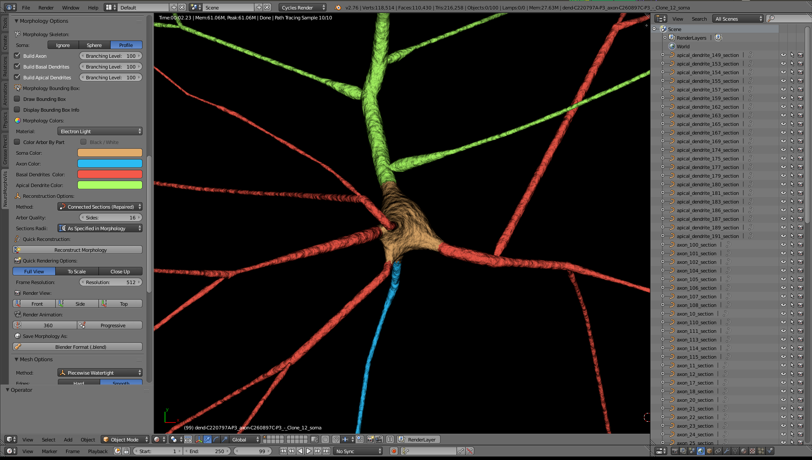
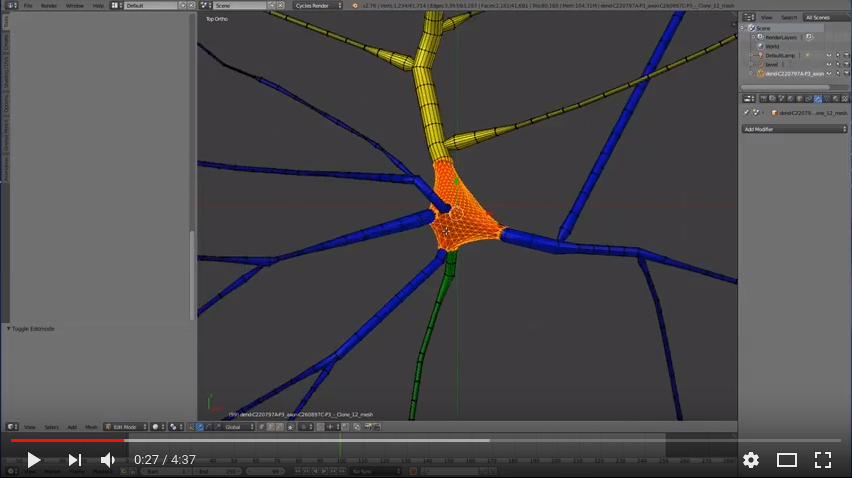

# NeuroMorphoVis


## Summary
NeuroMorphoVis is an interactive, extensible and cross-platform framework for building, 
visualizing and analyzing digital reconstructions of neuronal morphology skeletons extracted 
from microscopy stacks. The framework is capable of detecting and repairing tracing artifacts, 
allowing the generation of high fidelity surface meshes and high resolution volumetric models 
for simulation and in silico imaging studies.


## Dependencies 
The framework is mainly based on Blender. The current release uses the API of Blender 2.78b or 2.78c. Blender is a free software and can be downloaded from this [page](http://download.blender.org/release/). Blender comes with an LGPL license. 
There are other optional dependecies that are specific to users from [Blue Brain Project](https://github.com/BlueBrain). These dependencies are:
+ [HDF5 Python Bindings](https://www.h5py.org)
+ [Blue Brain Brion](https://github.com/BlueBrain/Brion) 


## Interfaces
NeuroMorphoVis is primarily designed as a plug-in in Blender. It comes with a user-friendly GUI and also with a rich set of command line options. Moreover, the tool is configurable via input configuration files making it possible to link it to web interface or using it on massively parallel visualization clusters for batch production.   

### GUI


### Command Line Options 
```
NeuroMorphoVis: a collaborative framework for analysis and visualization of 
        morphological skeletons reconstructed from microscopy stacks

optional arguments:
  -h, --help            show this help message and exit

Blender:
  Blender

  --blender BLENDER     Blender executable 
                        Default: blender, system installed: sudo apt-get install blender

Input:
  Input

  --input INPUT         Input morphology sources. 
                        Options: ['gid', 'target', 'file', 'directory']
  --morphology-file MORPHOLOGY_FILE
                        Morphology file (.H5 or .SWC)
  --morphology-directory MORPHOLOGY_DIRECTORY
                        Morphology directory containing (.H5 or .SWC) files
  --gid GID             Cell GID (requires BBP circuit).
  --target TARGET       Cell target in target file (requires BBP circuit).
  --blue-config BLUE_CONFIG
                        BBP circuit configuration

Output:
  Output

  --output-directory OUTPUT_DIRECTORY
                        Root output directory

Soma:
  Soma

  --soma-stiffness SOMA_STIFFNESS
                        Soma surface stiffness (0.001 - 0.999). 
                        Default 0.25.
  --soma-subdivision-level SOMA_SUBDIVISION_LEVEL
                        Soma surface subdivision level, between (3-7). 
                        Default 5.

Morphology Skeleton:
  Morphology Skeleton

  --reconstruct-morphology-skeleton
                        Reconstruct morphology skeleton for visualization or analysis.
  --morphology-reconstruction-algorithm MORPHOLOGY_RECONSTRUCTION_ALGORITHM
                        Morphology reconstruction algorithm. 
                        Options: ['connected-sections', 
                                  '(connected-sections-repaired)', 
                                  'disconnected-sections', 
                                  'disconnected-segments', 
                                  'articulated-sections']
  --morphology-skeleton MORPHOLOGY_SKELETON
                        Morphology skeleton style. 
                        Options: ['(original)', 'tapered', 'zigzag', 'tapered-zigzag']
  --soma-representation SOMA_REPRESENTATION
                        Soma representation in the reconstructed morphology. 
                        Options ['ignore', 'sphere', '(profile)']
  --ignore-axon         Ignore reconstructing the axon.
  --ignore-basal-dendrites
                        Ignore reconstructing basal dendrites.
  --ignore-apical-dendrites
                        Ignore reconstructing apical dendrites.
  --axon-branching-order AXON_BRANCHING_ORDER
                        Maximum branching order for the axon (1, infinity). 
                        Default 5.
  --apical-dendrites-branching-order APICAL_DENDRITES_BRANCHING_ORDER
                        Maximum branching order for the basal dendrites (1, infinity). 
                        Default infinity.
  --basal-dendrites-branching-order BASAL_DENDRITES_BRANCHING_ORDER
                        Maximum branching order for the apical dendrite (1, infinity).
                        Default infinity.
  --sections-radii SECTIONS_RADII
                        The radii of the morphological sections.
                        Options: ['(default)', 'scaled', 'fixed']
  --radii-scale-factor RADII_SCALE_FACTOR
                        A scale factor used to scale the radii of the morphology.
                        Valid only if --sections-radii = scaled.
                        Default is 1.0
  --fixed-section-radius FIXED_SECTION_RADIUS
                        A fixed radius for all morphology sections.
                        Valid only if --sections-radii = fixed.
                        Default is 1.0
  --bevel-sides BEVEL_SIDES
                        Number of sides of the bevel object used to reconstruct the morphology. 
                        Default 16 (4: low quality - 64: high quality)

Spines - Nucleus:
  Spines - Nucleus

  --spines SPINES       Build the spines and integrate them with the mesh. 
                        Options: ['(ignore)', 'circuit', 'random']
  --spines-quality SPINES_QUALITY
                        The quality of the spine meshes. 
                        Options: ['(lq)', 'hq']
  --random-spines-percentage RANDOM_SPINES_PERCENTAGE
                        The percentage of the spines that are added randomly (0-100). 
                        Default 50.
  --add-nucleus         Add nucleus mesh.

Materials - Colors:
  Materials - Colors

  --soma-color SOMA_COLOR
                        Soma color
  --axon-color AXON_COLOR
                        Axon color
  --basal-dendrites-color BASAL_DENDRITES_COLOR
                        Basal dendrites color
  --apical-dendrites-color APICAL_DENDRITES_COLOR
                        Apical dendrite color
  --spines-color SPINES_COLOR
                        Spines color
  --nucleus-color NUCLEUS_COLOR
                        Nucleus color
  --articulation-color ARTICULATION_COLOR
                        Articulations color. 
                        Valid only for the articulated-sections. 
                        Default Yellow.
  --shader SHADER       Shading mode or material. 
                        Options: (lambert) 
                                 electron-light 
                                 electron-dark 
                                 super-electron-light 
                                 super-electron-dark 
                                 shadow 
                                 flat 
                                 subsurface-scattering

Meshing:
  Meshing

  --reconstruct-soma-mesh
                        Reconstruct the mesh of the soma only.
  --reconstruct-neuron-mesh
                        Reconstruct the mesh of the entire neuron.
  --meshing-algorithm MESHING_ALGORITHM
                        Meshing algorithm. 
                        Options: ['(piecewise-watertight)', 'union', 'bridging']
  --edges EDGES         Arbors edges. 
                        This option only applies to the meshes. 
                        Options: ['smooth', '(hard)']
  --surface SURFACE     The surface roughness of the neuron mesh. 
                        Options: ['rough', '(smooth)']
  --branching BRANCHING
                        Arbors branching based on angles or radii. 
                        Options : ['angles', '(radii)']
  --tessellation-level TESSELLATION_LEVEL
                        Mesh tessellation factor between (0.1, 1.0).
                        Default 1.0.
  --global-coordinates  Export the mesh at global coordinates. 
                        Valid only for BBP circuits.

Export Options:
  You can export morphology skeletons or reconstructed meshes in various 
  file formats.

  --export-morphology-swc
                        Exports the morphology to (.SWC) file. 
  --export-morphology-h5
                        Exports the morphology to (.H5) file. 
  --export-morphology-blend
                        Exports the morphology as a Blender file (.BLEND).
  --export-neuron-mesh-ply
                        Exports the neuron mesh to (.PLY) file.
  --export-neuron-mesh-obj
                        Exports the neuron mesh to (.OBJ) file.
  --export-neuron-mesh-stl
                        Exports the neuron mesh to (.STL) file.
  --export-neuron-mesh-blend
                        Exports the neuron mesh as a Blender file (.BLEND).
  --export-soma-mesh-ply
                        Exports the soma mesh to a (.PLY) file.
  --export-soma-mesh-obj
                        Exports the soma mesh to a (.OBJ) file.
  --export-soma-mesh-stl
                        Exports the soma mesh to a (.STL) file.
  --export-soma-mesh-blend
                        Exports the soma mesh to a Blender file (.BLEND).

Rendering:
  Rendering

  --render-neuron-morphology
                        Render image of the morphology skeleton.
  --render-neuron-morphology-360
                        Render a 360 sequence of the morphology skeleton.
  --render-neuron-morphology-progressive
                        Render a progressive reconstruction of the morphology skeleton.
  --render-soma-skeleton
                        Render a static image of the soma skeleton (connected profile).
  --render-soma-mesh    Render an image of the reconstructed soma mesh.
  --render-soma-mesh-360
                        Render a 360 sequence of the reconstructed soma mesh.
  --render-soma-mesh-progressive
                        Render a sequence of the progressive reconstruction of the soma mesh.
  --render-neuron-mesh  Render an image of the reconstructed neuron mesh.
  --render-neuron-mesh-360
                        Render a 360 sequence of the reconstructed neuron mesh.
  --render-to-scale     Render the skeleton to scale.
  --rendering-view RENDERING_VIEW
                        The rendering view of the skeleton for the skeleton. 
                        Options: ['close-up', 'mid-shot', '(wide-shot)']
  --camera-view CAMERA_VIEW
                        The camera direction. 
                        Options: ['(front)', 'side', 'top']
  --close-up-dimensions CLOSE_UP_DIMENSIONS
                        Close up dimensions (the view around the soma in microns). 
                        Valid only when the --rendering-view = close-up. 
                        Default 20.
  --full-view-resolution FULL_VIEW_RESOLUTION
                        Base resolution of full view images (wide-shot or mid-shot). 
                        Default 1024.
  --close-up-resolution CLOSE_UP_RESOLUTION
                        Base resolution of close-up images. 
                        Valid only when the --rendering-view = close-up. 
                        Default 512.
  --resolution-scale-factor RESOLUTION_SCALE_FACTOR
                        A factor used to scale the resolution of the image. 
                        Valid only if --render--to-scale is set. 
                        Default 1.

Execution:
  Execution

  --execution-node EXECUTION_NODE
                        Execution is local or using cluster nodes. 
                        Options: ['(local)', 'cluster']
  --number-cores NUMBER_CORES
                        Number of execution cores on cluster. 
                        Default 256.
  --job-granularity JOB_GRANULARITY
                        The granularity of the jobs running on the cluster. 
                        Options: ['high', '(low)']

Analysis:
  Analysis

  --analyze-morphology  Analyze the morphology skeleton and report the artifacts.

```


Neuronal soma reconstruction 
[](https://www.youtube.com/watch?v=v02HogkFODU)

Morphology visualization 
[](https://www.youtube.com/watch?v=74PGirMx3ks&t=102s)

Neuronal mesh reconstruction 
[](https://www.youtube.com/watch?v=oxCKwrZSV98&t=130s)




### Morphology Shading Styles
The users can select to visualize and render the morphologies in different styles based on a set of shaders that are customized and adapted to create high quality images for illustrative purposes or scientitifc publications. 


## Publication & Citation 
If you use NeuroMorphoVis for your research, media design or other purposes, please cite our paper [NeuroMorphoVis: a collaborative framework for analysis and visualization of neuronal morphology skeletons reconstructed from microscopy stacks](https://academic.oup.com/bioinformatics/article/34/13/i574/5045775) using the following entry:

```
@article{abdellah2018neuromorphovis,
  title={NeuroMorphoVis: a collaborative framework for analysis and visualization of neuronal morphology skeletons reconstructed from microscopy stacks},
  author={Abdellah, Marwan and Hernando, Juan and Eilemann, Stefan and Lapere, Samuel and Antille, Nicolas and Markram, Henry and Sch{\"u}rmann, Felix},
  journal={Bioinformatics},
  volume={34},
  number={13},
  pages={i574--i582},
  year={2018},
  publisher={Oxford University Press}
}
```
