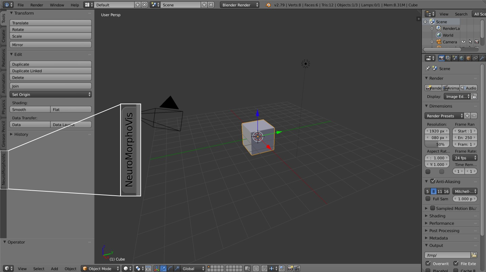
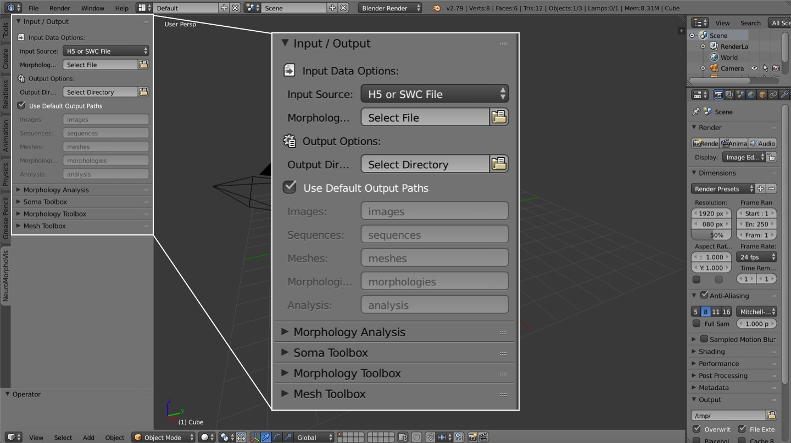
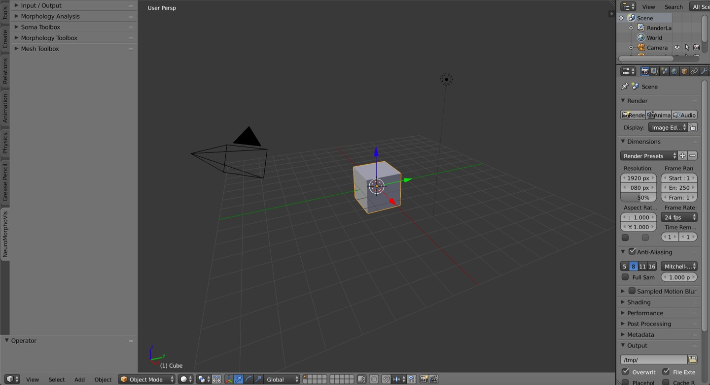
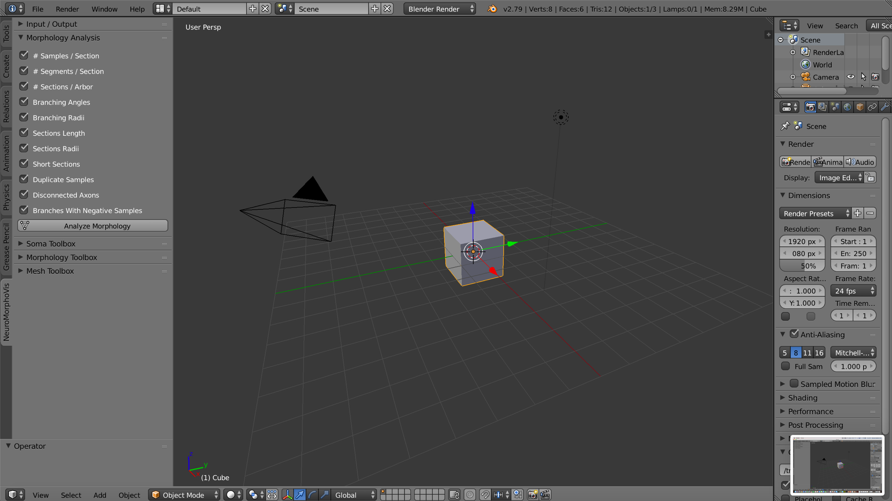
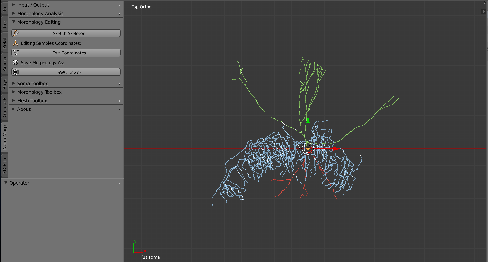
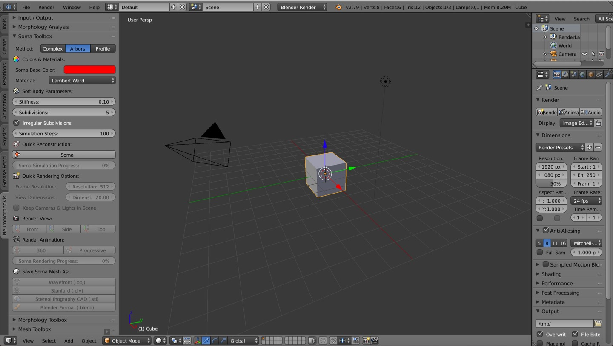
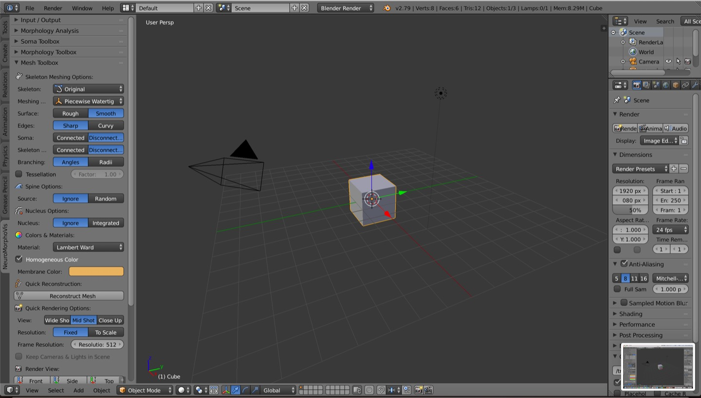

# GUI User Guide

## Rationale 
To make it accessible to end users with minimal programming knowledge or even with no programming experience at all, the core functionality of _NeuroMorphoVis_ is exposed to users via a friendly graphical user interface that would allow them to navigate and adjust the parameters of the different toolboxes seamlessly. This page provides a detailed guide to use _NeuroMorphoVis_ from its GUI. 

	

## Landing 
After loading it from the [Add-ons](https://docs.blender.org/manual/fi/dev/preferences/addons.html) manager of Blender, _NeuroMorphoVis_ will appear as a new tab on the left side of Blender. 

	

When the user clicks on this tab, the following panel will appear.

	

 

In the current version of _NeuroMorphoVis_, this panel contains seven sections or tabs:

+ __Input / Output__ 
+ __Morphology Analysis__
+ __Morphology Editing__
+ __Soma Toolbox__
+ __Morphology Toolbox__
+ __Mesh Toolbox__ 
+ __About__

By default, the _Input / Output_ tab is open while the rest of the tabs are closed. This action is intended to avoid any distraction or negative impressions given to the user. Each tab has already many parameters that can be configured to control certain aspects. Therefore, it is advisable to open __only__ the tab the user is interested in and close the rest of the tabs to avoid any clutter.

Before switching to any other tab, the user must specify in the _Input / Output_ tab the __input morphology__ and the __output directories__ where the different artifacts will be generated. This [guide](input-output.md) explains how to use the _Input / Output_ tab to select a specific morphology either from file by its full path or from a BBP circuit using its GID.

## Using the Toolboxes      
After selecting the input morphology as shown in the previous section, the users can navigate to any of the toolboxes by clicking on their respective tabs to process the morphology according to their specific purposes. It is highly recommended to close the _Input / Output_ tab before moving to the other tabs. 

	

 

### Morphology Analysis 

The _Morphology Analysis_ toolbox can be loaded by clicking on the _Morphology Analysis_ tab. This [guide](morphology-analysis.md) explains how to use this toolbox to analyze the morphology skeleton.      

	

 

### Morphology Editing 
The _Morphology Editing_ toolbox can be loaded by clicking on the _Morphology Editing_ tab. his [guide](morphology-editing.md) explains how to use this toolbox to analyze the morphology skeleton.      

	

 

### Soma Reconstruction 

The _Soma Reconstruction_ toolbox can be loaded by clicking on the _Soma Toolbox_ tab. This [guide](soma-reconstruction.md) explains how to use this toolbox to create three-dimensional profiles of the somata on a physically-plausible basis using Hooke's law and mass-spring models.
  

	

 

### Morphology Reconstruction 

The _Soma Reconstruction_ toolbox can be loaded by clicking on the _Morphology Toolbox_ tab. This [guide](morphology-reconstruction.md) explains how to use this toolbox to create and sketch three-dimensional models of the morphology.

	

 

### Mesh Reconstruction  

The _Mesh Reconstruction_ toolbox can be loaded by clicking on the _Mesh Toolbox_ tab. This [guide](mesh-reconstruction.md) explains how to use this toolbox to create polygonal mesh models of the neuron from its morphology skeleton.

	

 

### About 
If you would like to update _NeuroMorphoVis_, you can open this tab and clock on the __Update__ button, which will pull the latest version of the tool and restarts your Blender application. 
