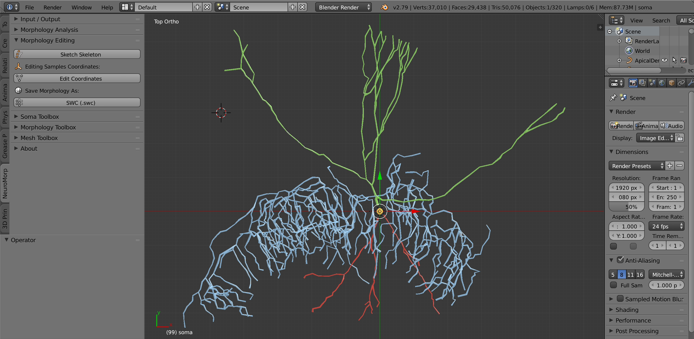
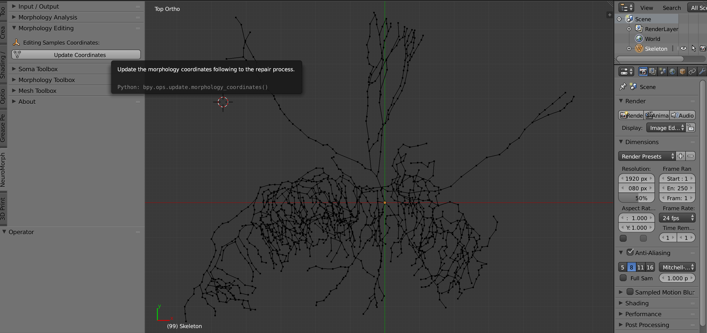
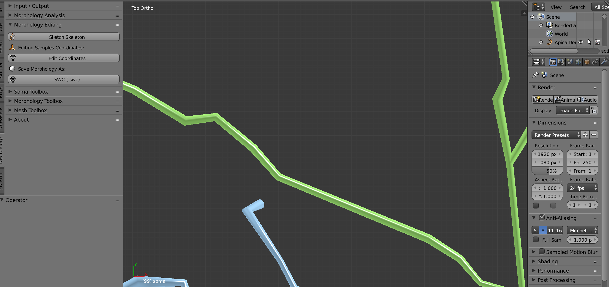
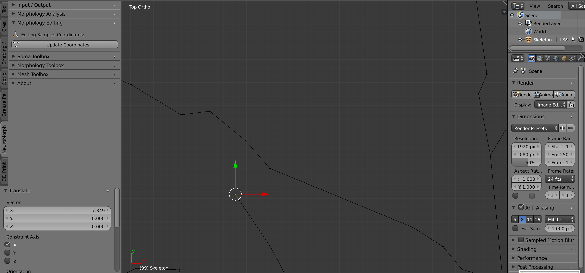
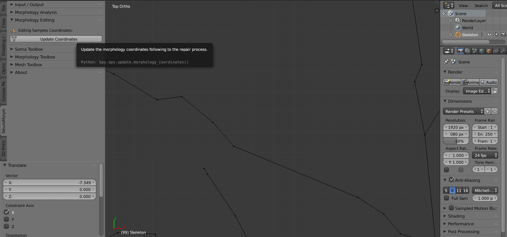
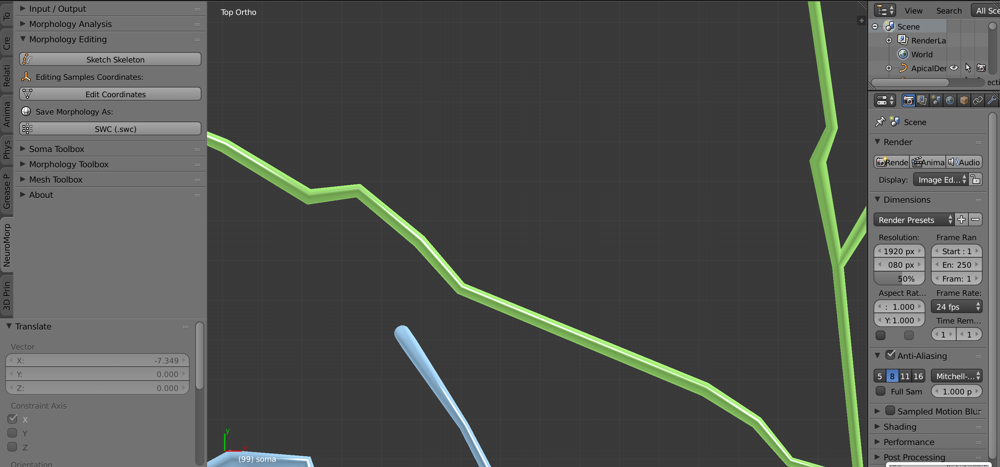
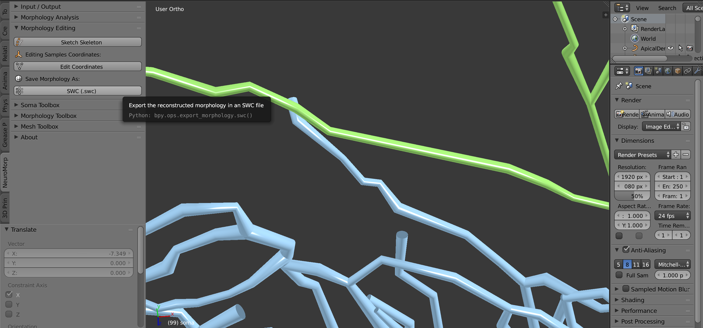

# Morphology Editing Toolbox Panel

  

## Summary
This panel gives access to allow the user to modify a broken morphology skeleton.       

## Why this Toolbox?
In certain cases, in particular, when a morphology file is downloaded from an open database, this 
morphology could be broken, i.e. self-intersecting branches or overlapping samples on any of its arbors.
For such reasons, we have added a little utility that allows the user to sketch the morphology skeleton
and edit the skeleton samples by moving the samples from one point to another. Then, the user can either 
export this modified morphology skeleton or to use it for other toolboxes in _NeuroMorphoVis_.

## How to use this Toolbox?

After loading the morphology, the user can sketch the a tube representation of the morphology to visualizae and analyze its three-dimensional structure by clicking on __Skecth Skeleton__ button.  

  

The user can then modify the skeleton by clicking on the __Edit Coordinates__ button, which will convert the tubes representation into a skeleton with a series of points connected with poly-lines. Note that all the arbors of this morphology are all connected to the origin. 

After identifying a broken sample from the sketched skeleton, the user can move it from one point to another. 

  

The user can click on this sample and move it.

  

  

Once the editing is done, the modified skeleton is re-drawn with the tube representation by clicking on the __Update Coordinates__ button. 

  

  

Finally the user can export this morphology skeleton to a file using the __SWC__ button, or use it for the other toolboxes. 

  

  

