# Morphology Reconstruction Toolbox Panel

  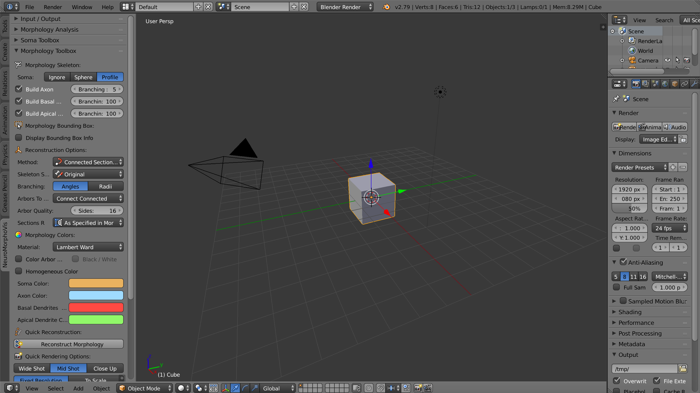

## Introduction

This panel gives access to the parameters of the __Morphology Reconstruction Toolbox__. By reconstruction in the context, we mean generating a three-dimensional skeleton from a dendrogram (a tree diagram frequently used to illustrate the arrangement of the clusters produced by hierarchical clustering, for further details refer to this [link](https://en.wikipedia.org/wiki/Dendrogram)). 

### What is a Morphology Skeletion?

Neuronal morphologies are reconstructed from imaging stacks obtained from different microscopes. These morphologies can be digitized either with semi-automated or fully automated tracing methods. The digitization data can be stored in multiple file formats such as SWC and the Neurolucida proprietary formats. For convenience, the digitized data are loaded, converted and stored as a tree data structure (a data structure representing the dendrogram). 

### Morphology Components

The skeletal tree of a neuron is defined by the following components: a cell body (or soma), sample points, segments, sections, and branches. The soma, which is the root of the tree, is usually described by a point, a radius and a two-dimensional contour of its projection onto a plane or a three-dimensional one extracted from a series of parallel cross sections. Each sample represents a point in the morphology having a certain position and the radius of the corresponding cross section at this point. Two consecutive samples define a connected segment, whereas a section is identified by a series of non-bifurcating segments and a branch is defined by a linear concatenation of sections.  

Neuronal branches are, in general, classified based on their types into 
 
 + axons, 
 + apical dendrites and 
 + basal dendrites. 
 
### Important Note

Note that the three-dimensionap profile of the soma that is reconstructed in this skeleton -- if requested -- is based on the parameters set in the __Soma Toolbox panel__.

### Why this Toolbox?

There are various packages that have been developed to analyze and visualize different formats of neuronal morphology skeletons. Free and open source packags are quite limited in their functionality and some of them require installing multiple software dependencies that might make them cumbersome and hard to use. Non-free or proprietary solutions might not be affordable in certain cases and they are only focused on morphology visualizatin. _NeuroMorphoVis_ close the gap and presents a free framework for advanced visualiztion of the morphologies, visual analysis, mesh generation of neuronal membranes and high quality rendering for scientific publications, all integrated in a single tool.      

#### Morphology Analysis Tools 

+ [MATLAB-based Morphology Analyzer](https://www.ncbi.nlm.nih.gov/pmc/articles/PMC3928584/) by J. Ledderose et al, 2014

#### Morphology Visualization Tools

+ [HBP Morphology Viewer](https://neuroinformatics.nl/HBP/morphology-viewer/) by [HBP](https://www.humanbrainproject.eu/en/) - Online repository can be found [here](https://github.com/rbakker/HBP-morphology-viewer). 

+ [NeuronLand: NLMorphologyViewer](http://neuronland.org/NL.html) A simple user interface built on top of the technology developed for the NLMorphologyConverter. Provides a 3D interactive view of neuron morphology data.

+ [Web-based neuron morphology viewer](https://www.frontiersin.org/10.3389/conf.fninf.2016.20.00079/event_abstract) by R. Bakker and P. Tiesinga, 2013.
 

## Opening the Morphology Toolbox Panel

  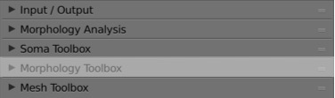

When you toggle (or click on) the __Morphology Toolbox__ tab highlighted above, the following panel, or a similar one depending on the version of _NeuroMorphoVis_, will appear.

  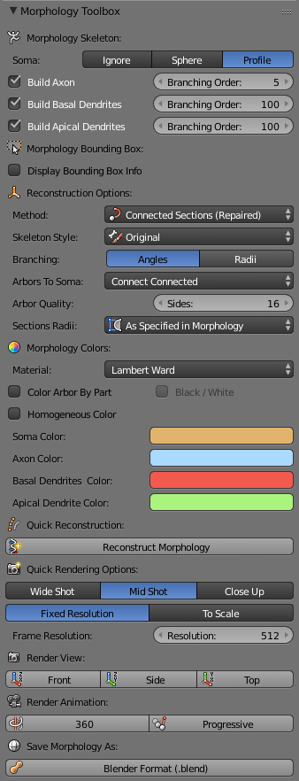

In the following sections we will detail all the parameters shown in each section in this panel.
 
## Morphology Skeleton Parameters

In this section the user can select which components of the morphology skeletion will be reconstructed and generated in the scene.

### Soma 

The soma object can be _ignored_, represented symbolically by a _sphere_, or represented by an accurate _three-dimensional profile_ that can approximate its actual shape. 

  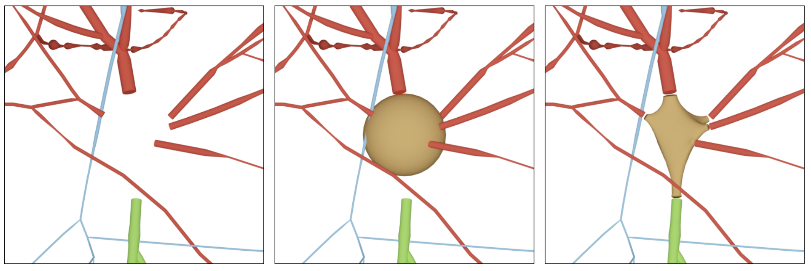

The user can select one of the following options:

+ __Ignore__
The soma is totally ignored. 

  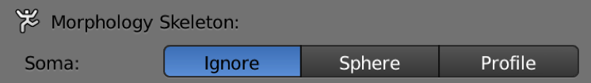

+ __Sphere__ 
The soma is symbolically represented by a sphere whose center is _usually_ set to the origin and radius is set to the mean radius reported in the morphology file. 

  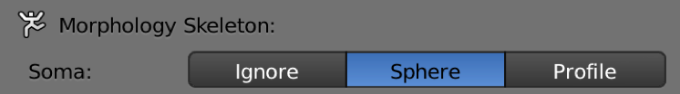

+ __Profile__ 
The soma is usually described in the morphology file by a point, a radius and a two-dimensional contour of its projection onto a plane. We use this data and reconstruct a three-dimensional profile of the soma using Hooke's law and the physics engine of Blender. If this option is selected, a realistic shape of the soma will be reconstructed and added to the scene.  Note that this profile is reconstructed based on the parameters set in the _Soma Toolbox panel_.

  

### Branches 

The user can add arbitrarly any branch of a specific type - if exists in the original morphology file - or remove it from the reconstructed skeleton. For example, in certain cases, the axon might not be that important to visualze. The user can remove the axon from the reconstructed object by unchecking the _Build Axon_ checkbox. 

  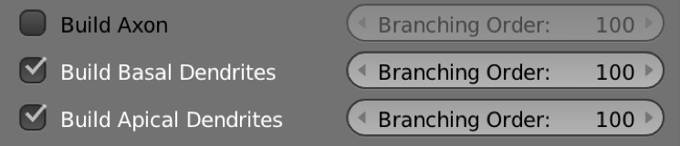

The user can also select or highlight a specific branch type to visualize, for example basal dendrites. In this case the _Build Basal Dendrites_ checkbox must be checked and the _Build Axon_ and _Build Apical Dendrites_ checkboxes must be unchecked. 

  

The maximum branching order of each type (axon, basal dendrite or apical dendrite) can be controled from the _Branch Order_ slider that corresponds to each branch type. For example, in the image below, the maximum branching order of the axon is set to 5, while the maximum branching orders of the apical and basal dendrites are set to 100. In general, setting the maximum branching order to 100 guarantees that all the branches will be reconstructed in the scene.  

  

 
## Morphology Reconstruction Parameters
  
### Reconstruction Method

+ __Connected Sections (Original)__
This method connects the different sections that form a continuation from a parent section to a child one along a single arbor. 

+ __Connected Sections (Repaired)__
This is the default reconstruction method.    

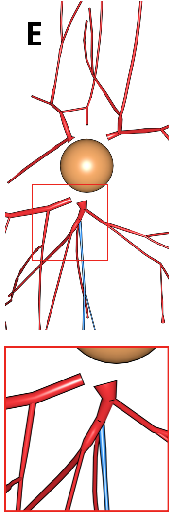
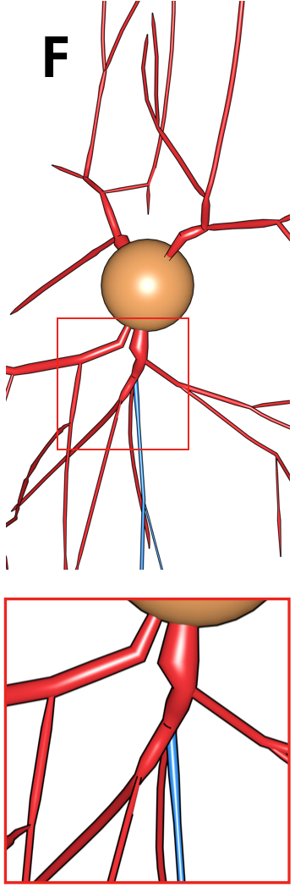

+ __Disconnected Sections__
his method reconstructs each section in the morphology as a single tubed-polyline whose radius varies depending on that of each sample along the section.

 

+ __Articulated Sections__
This method reconstructs each section in the morphology as a single tubed-polyline whose radius varies depending on that of each sample along the section. The only difference between this method and the _Disconnected Sections_ method is that the children sections are articulated with the parent section on a sphere whose radius is equiavlent to that of the sample at the branching point. This reconstruction method is similar to that used in [_Neurolucida_](https://www.mbfbioscience.com/neurolucida).  

 

+ __Disconnected Segments__
This method reconstructs each segment in the skeleton as an independent and disconnected tapered cylinder. This approach might be slow when the morphology has complex dendritic or axonal arborizations, but it is quite useful for debugging morphologies that come with manual tracing artifacts.  

  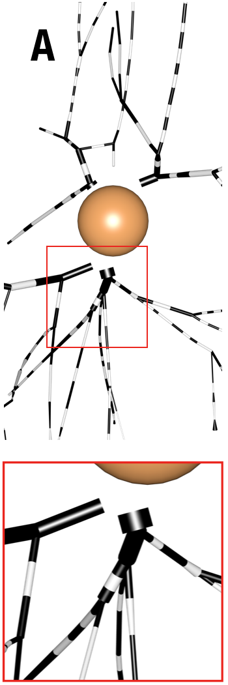
  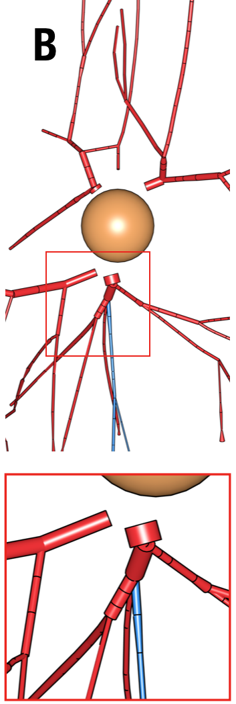 

 

+ __Disconnected Skeleton__
This method is similar to the _Disconnected Sections_ one, but it does not take the branching point into considerations. Therefore, there will be gapps between the parent and children sections at the bifurcation or trifurcation points.

### Skeleton Style 

  

### Branching 

+ __Radii__
This option is the default. 

  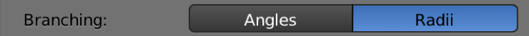

 
+ __Angles__  

  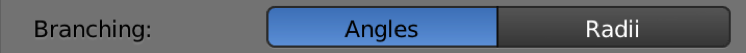

  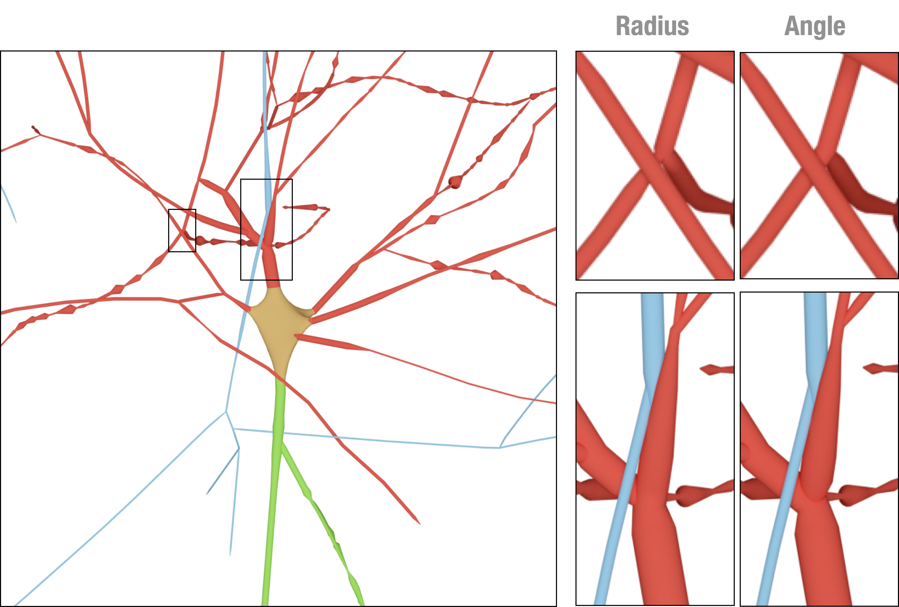

### Arbor Quality 

### Sections Radii 

  

+ __As Specified in Morphology__
The morphology skeleton is reconstructed using the radii specified in the morphology file. _NeuroMorphoVis_ does not apply any pre-processing kernels to change the radii of the samples. In certain cases, some branches - for example the axons - are extremely thin to be seen in the rendering. If the user is interested to visualizae the structure of the entire skeleton in focus, the following two options can be alternatively used.   

+ __At a Fixed Diamater__
The user can change the radius of all the sections of the morphology from the _Fixed Radius Value_ slider. 
  

  

  

+ __With Scale Factor__
To preserve the respective scales of the sections across the morphology skeleton, NeuroMorphoVis has added support to scale the radii of the sections.
The user can change the scale factor of the radii from the _Radius Scale Factor_ slider. 
  

  

  

## Morphology Colors and Shading Parameters
 

  

### Selecting Material 

+ __Lambert Ward__ 
For further details about lambert shading, you can refer to this [link](https://en.wikipedia.org/wiki/Lambertian_reflectance). Note that this shader uses Blender renderer.

+ __Flat__
Note that this shader uses Blender renderer.

+ __Electron Light__
Note that this shader user the Cyles renderer, so it could be quite slow if the rendering resolution exceeds 1024.

+ __Electron Dark__
Note that this shader user the Cyles renderer, so it could be quite slow if the rendering resolution exceeds 1024.

+ __Super Electron Light__
Note that this shader user the Cyles renderer, so it could be quite slow if the rendering resolution exceeds 1024.

+ __Super Electron Dark__
Note that this shader user the Cyles renderer, so it could be quite slow if the rendering resolution exceeds 1024.

+ __Glossy__
Note that this shader user the Cyles renderer, so it could be quite slow if the rendering resolution exceeds 1024.

+ __Shadow__
Note that this shader user the Cyles renderer, so it could be quite slow if the rendering resolution exceeds 1024.

  

  

### Color Scheme 

  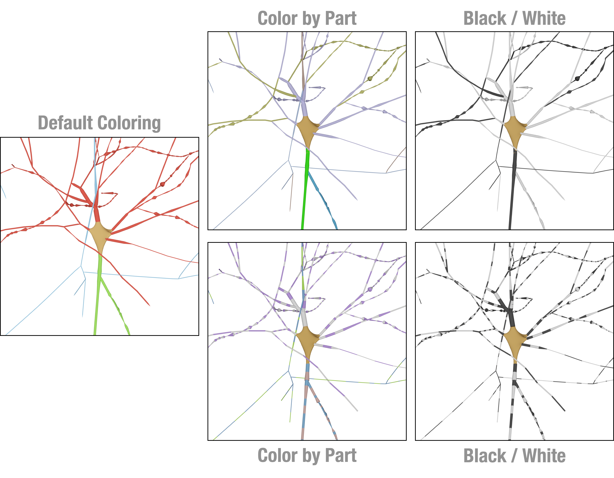

#### Color Arbor by Part

  

#### Black White 

  

#### Homogeneous Color

By default, _NeuroMorphoVis_ allows the user to assign different colors to each component in the morphology, mainly: axons, apical dendrites, basal dendrites and the somata. In certain use cases, the user might want to assign the same color to all the components of the morphology. This step would require setting the HEX (or RGB) color code to each component, which might be inconvenient if the user would like to test multiple colors. Therefore, _NeuroMorphoVis_ has an option to assign a homogeneous color to all the components of the morphology with a single click. The user must check the _Use Homogeneous Color_ checkbox and click on the _Membrane Color_ panel to select the desired color.

  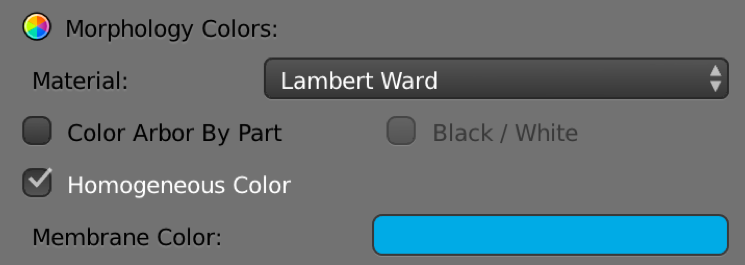

The following figure shows two close up images of the same morphology skeleton when rendered with different colors for each component in comparison with using a homogeneous color for all the components. 
 

  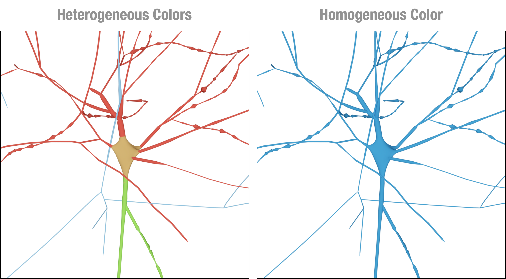

## Let's Reconstruct the Morphology 

Once the morphology parameters are set as shown before, the user can reconstruct a morphology skeleton by clicking on the _Reconstruct Morphology_ button. 
  

  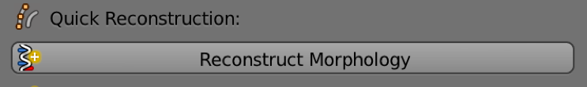

Note that if any of the parameters are changed the user must re-click on this button again to update the morphology. 

## Rendering Parameters 

### Rendering View 

+ __Wide Shot__

  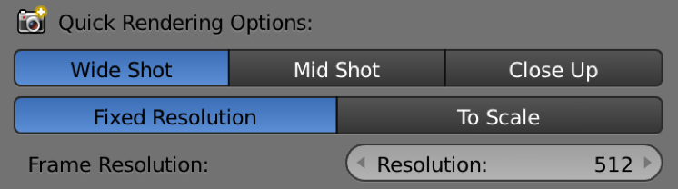

+ __Mid Shot__

  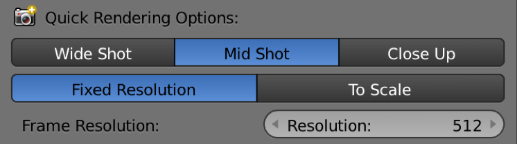

+ __Close Up__

  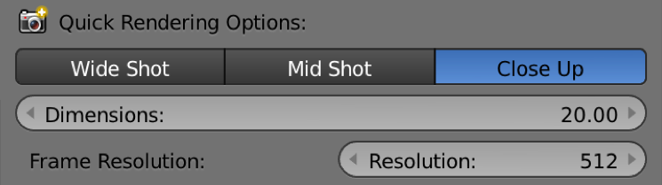

_NeuroMorphoVis_ has added support to set the resolution of the rendered images either to a __fixed__ resolution or based on the __dimensions of the morphology skeleton__. The later option is mandatory for images that are required for scientific articles or publications. It allows the user to render images __to scale__ and overlay a scale bar on the top of the image. 

+ __Fixed__ The resolution of the image is normally defined by two parameters (width and height) in pixels, however, NeuroMorphoVis forces the users to define the resolution of the image using a single parameter to avoid rendering a distorted image.  
 
+ __To Scale__ Before rendering the reconstructed mesh into an image, the three-dimensional bounding box (width, height and depth) of the mesh is automatically computed and the resolution of the image is defined based on _1) the bounding box of the mesh_ and _2) the rendering view_. For example if the bounding box of the mesh is 100 x 200 x 300 and a front view is rendered, then the resolution of the image will be set automatically set to 100 x 200. If the side view of the mesh is rendered, then the resolution of the image will be set to 200 x 300 and finally if the top view is rendered, then the resolution of the image will be set to 300 x 100. If the user wants to render an image to scale, then option _To Scale_ must be selected. In this case, each pixel will correspond in the image to 1 micron, and the resolution of the image is limited to the dimensions of the morphology. To render higher resolution images, however to scale, we have addedd support to scale the resolution of the image using a scale factor that is defined by the user. When the user select the _To Scale_ option, the _Scale Factor_ slider appears below to give the user the control to select the most approriate scale factor that fits the objective ultimate objectives of the image. By default, the scale factor is set to 1. Note that increasing the scale factor will make the rendering process taking longer _O(NXM)_. A convenient range for the scale factor is 3-5.

## Let's Render the Morphology

### Rendering an Image

After setting all the rendering parameters as shown in the previous steps, the users can render an image of the morphology using any of the following buttons:

+ __Front__
This button renders the front view of the reconstructed morphology.

+ __Side__
This button render the side view of the reconstructed morphology.

+ __Top__ 
This button renders the top view of the reconstructed morphology.

  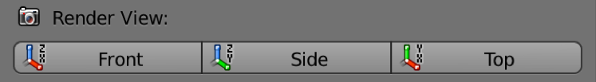

### Rendering a Movie

NeuroMorphoVis has added support to render two types of movies: _360_ and _Progressive_ sequence. 

+ __360__
The user can render a 360 movie to visualize the morphology from the different views.

+ __Progressive__  
The user can render a progressive animation showing the progressive reconstruction (or the growth) of the morphology. The resulting movie depends on the method used to reconstruct the morphology. 

  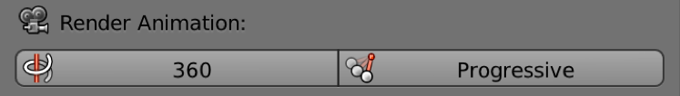

## Morphology Export 

The current version of NeuroMorphoVis supports exporting the reconstructed morphology into _.blend_ file.  

+ __Export as a Blender File__
To export the morphology into a _.blend_ file, click on the _Blender Format (.blend)_ button under the _Save Morphology As_ section.

  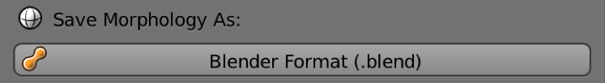

