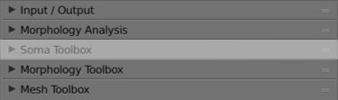
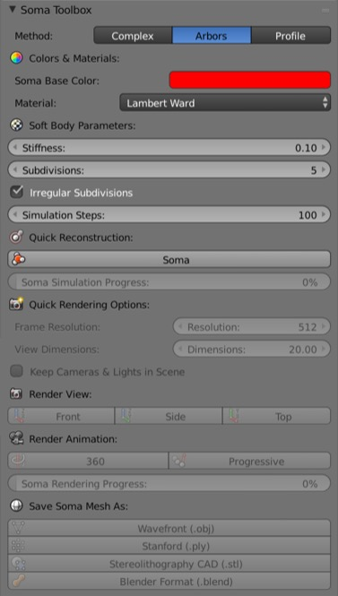

# Soma Toolbox Panel

  

## Introduction
This panel gives access to the parameters of the __Soma Reconstruction Toolbox__.      

## Why this Toolbox?
Due to the fuzzy definition of the soma, the relevant information contained in generic morphology skeletons that describe the soma is usually insufficient to reconstruct a realistic representation of it. In those morphologies, the soma is merely represented by a centroid, a radius that approximates the average distance between this centroid and the initial segments of each neurite, and a projective profile that is traced along a two-dimensional plane. In certain studies, the soma is not modeled based on the reported data in the morphological skeleton, but rather represented by an implicit surface for convenience. Therefore, the reconstruction of even an approximation of the soma contour is quite challenging. Recent methods have been presented to provide a univocal definition of the somata, allowing automated characterization of neurons and accurate segmentation of three-dimensional somata profiles measured at multiple depths of fields during the tracing procedure.

The __Soma Reconstruction Toolbox__ is added to allow the generation of highly plausible somata profiles relying on their two-dimensional contours and the starting locations of their neurites. The process simulates the progressive reconstruction of the soma using _Hooke’s law_ and _mass spring models_. The idea has been adapted from a recent study ([Brito et al., 2013](https://www.frontiersin.org/articles/10.3389/fnana.2013.00015/full)) and implemented in Blender using its physics engine ([Abdellah et al., 2017b](https://bmcbioinformatics.biomedcentral.com/articles/10.1186/s12859-017-1788-4)). 

We extended the Blender-based implementation and integrated this module into _NeuroMorphoVis_ to provide a convenient tool to validate and compare the somata obtained by segmenting a microscopic stack with the ones extracted from three-dimensional contours.

## Opening the Soma Toolbox

  

When you toggle (or click on) the _Soma Toolbox_ tab highlighted above, the following panel, or a similar one depending on the version of _NeuroMorphoVis_, will appear.

  

In the following sections, we will detail all the parameters shown in each section in this panel.

## Method 
This version of _NeuroMorphoVis_ has implemented three different methods to reconstruct three-dimensional somata profiles:

+ __Profile__: This method uses only the profile points that are reported in the morphology files to reconstruct the soma from an ico-sphere, whose radius is set to the mean soma radius. 
   

  

+ __Arbors__: This method uses the starting points of each root arbor to deform an ico-sphere. This is the deafult reconstruction method.
 

  

+ __Complex__: This is a combined method of the two previous ones. The pulling occurs towards the profiles points and the starting points of each neurite connected to the soma.

  

