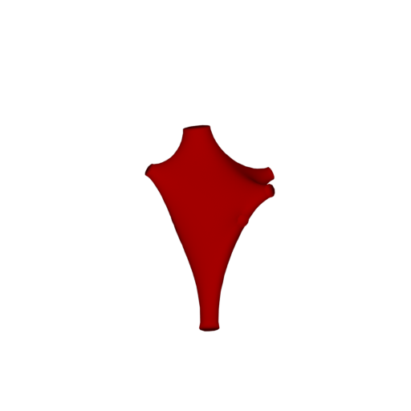

# Soma Toolbox Panel

## Summary
This panel gives access to the parameters of the __Meshing__ Toolbox.      

## Expected Output 
The current version of NeuroMorphoVis implements the __piecewise-watertight meshing__ algorithm that is proposed by [Abdellah et al, 2017.](https://bmcbioinformatics.biomedcentral.com/articles/10.1186/s12859-017-1788-4). This method reconstructs a single mesh object that is composed of a set of watertight meshes, each corresponding to an individual component in the original morphology skeleton. For example, breadth-first traversal is used to connect and construct primary sections along each arbor in the form of tubes. These tubes are converted into watertight meshes that by definition have non manifold edges or vertices. The grouping of the reconstructed meshes results in the final mesh object that is not watertight per se, but rather piecewise-watertight.          


## Method 
NeuroMorphoVis has three methods to reconstruct different three-dimensional somata profiles:
+ __Profile__: This method uses only the profile points that are reported in the morphology files to reconstruct the soma from an ico-sphere, whose radius is set to the mean soma radius.   
<p align="center">
  
</p>

+ __Arbors__: This method uses the starting points of each root arbor to deform an ico-sphere. 
<p align="center">
  
</p>

+ __Complex__: This is a combined method of the two previous ones.
<p align="center">
  
</p>


### Input Source
+ The users can load morphologies from individual .SWC or .H5 files based on their absolute pathes in the file system. In this case, the __Input Source__ option should be set to __H5 or SWC File__, and the path to the morphology file should be set in the __Morphology File__ text box. You can also use the button on the right of the text box to open a file dialog and select the file from a specific path.

<p align="center">
  
</p>

+ The users can also load a morphology of a certain neuron reconstructed in a BBP circuit using its GID. In this case, the __Input Source__ option should be set to __BBP Circuit (GID)__, and then the path to the circuit configuration should be set in the __Circuit File__ text box (replace __Select Circuit File__ by the absolute path of the circuit, for example: /gpfs/WHATEVER_PROJECT/config.circuit) and the GID of the neuron should be set in the __GID__ field (replace __Add a GID__ by the GID of the neuron, for example: 1000).  

<p align="center">
  
</p>

### Output Options
NeuroMorphoVis can be only used to load and visualize morphologies. But if the users would like create any output, for example images, videos or meshes, then the __Output Directory__, where there artifacts will be generated, __must__ be set (replace __Select Directory__ by the absolute path of the output directory).

#### Output Tree
When the output directory is created, it automatically creates a list of subdirectories, each of them will contain a specific type of output. The default structure of the out directory is as follows 

```bash
OUTPUT_DIRECTORY
├── images
├── sequences
├── meshes
├── morphologies
├── analysis
```

If the user wants to change the name any of these subdirectories, then the checkbox __Use Default Output Paths__ must be unchecked. 

<p align="center">
  
</p>
