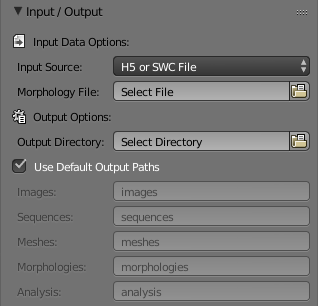
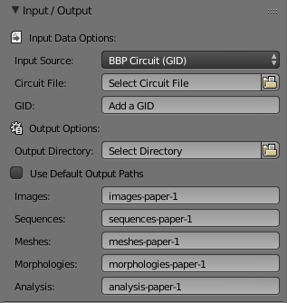

# Soma Toolbox Panel

## Summary
This panel gives access to the parameters of the Soma Toolbox.      

## Approach 
Due to the fuzzy definition of the soma, the relevant information contained in generic morphology skeletons that describe the soma is usually insufficient to reconstruct a realistic representation of it (Brito et al., 2013; Luengo-Sanchez et al., 2015). In those morphologies, the soma is merely represented by a centroid, a radius that approximates the average distance between this centroid and the initial segments of each neurite, and a projective profile that is traced along a two-dimensional plane (Abdellah et al., 2017b; Halavi et al., 2008; Lasserre et al., 2012). In certain studies, the soma is not modeled based on the reported data in the morphological skeleton, but rather represented by an implicit surface for convenience (Ostroumov, 2007). Therefore, the reconstruction of even an approximation of the soma contour is quite challenging. Recent methods have been presented to provide a univocal definition of the somata, allowing automated characterization of neurons and accurate segmentation of three-dimensional somata profiles measured at multiple depths of fields (Fig. 2) during the tracing procedure (Luengo-Sanchez et al., 2015; Pawelzik et al., 2002). However, this approach can be applied only in advanced reconstructions (Abdellah et al., 2017b).

The soma reconstruction module is added to allow the generation of highly plausible somata profiles relying on their two-dimensional contours and the starting locations of their corresponding neurites. This process simulates the progressive reconstruction of the soma using Hooke’s law and mass spring models (Nealen et al., 2006; Terzopoulos et al., 1987). The idea has been adapted from a recent study (Brito et al., 2013) and implemented in Blender (Blender, 2016) using its physics engine (Abdellah et al., 2017b). 

## Method 
NeuroMorphoVis has three methods that can reconstruct different three-dimensional profiles of the soma:
+ Profile, where 
The current version of NeuroMorphoVis can read morphologies stored in the following file formats:
+ The standard [.SWC](http://www.neuronland.org/NLMorphologyConverter/MorphologyFormats/SWC/Spec.html) file format. 
+ [H5](https://developer.humanbrainproject.eu/docs/projects/morphology-documentation/0.0.2/index.html) file format. This format is specific to the Blue Brain Project / Human Brain Projects, but the python bindings of HDF5 library must be installed to the system to load it.   

### Input Source
+ The users can load morphologies from individual .SWC or .H5 files based on their absolute pathes in the file system. In this case, the __Input Source__ option should be set to __H5 or SWC File__, and the path to the morphology file should be set in the __Morphology File__ text box. You can also use the button on the right of the text box to open a file dialog and select the file from a specific path.

<p align="center">
  
</p>

+ The users can also load a morphology of a certain neuron reconstructed in a BBP circuit using its GID. In this case, the __Input Source__ option should be set to __BBP Circuit (GID)__, and then the path to the circuit configuration should be set in the __Circuit File__ text box (replace __Select Circuit File__ by the absolute path of the circuit, for example: /gpfs/WHATEVER_PROJECT/config.circuit) and the GID of the neuron should be set in the __GID__ field (replace __Add a GID__ by the GID of the neuron, for example: 1000).  

<p align="center">
  
</p>

### Output Options
NeuroMorphoVis can be only used to load and visualize morphologies. But if the users would like create any output, for example images, videos or meshes, then the __Output Directory__, where there artifacts will be generated, __must__ be set (replace __Select Directory__ by the absolute path of the output directory).

#### Output Tree
When the output directory is created, it automatically creates a list of subdirectories, each of them will contain a specific type of output. The default structure of the out directory is as follows 

```bash
OUTPUT_DIRECTORY
├── images
├── sequences
├── meshes
├── morphologies
├── analysis
```

If the user wants to change the name any of these subdirectories, then the checkbox __Use Default Output Paths__ must be unchecked. 

<p align="center">
  
</p>
