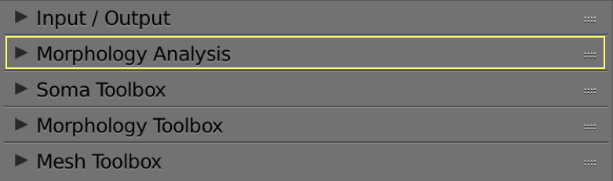

# Morphology Analysis Panel

  

## Summary
This panel gives access to the parameters of the Soma Toolbox.      

## Why this Toolbox?
Due to the fuzzy definition of the soma, the relevant information contained in generic morphology skeletons that describe the soma is usually insufficient to reconstruct a realistic representation of it. In those morphologies, the soma is merely represented by a centroid, a radius that approximates the average distance between this centroid and the initial segments of each neurite, and a projective profile that is traced along a two-dimensional plane. In certain studies, the soma is not modeled based on the reported data in the morphological skeleton, but rather represented by an implicit surface for convenience. Therefore, the reconstruction of even an approximation of the soma contour is quite challenging. Recent methods have been presented to provide a univocal definition of the somata, allowing automated characterization of neurons and accurate segmentation of three-dimensional somata profiles measured at multiple depths of fields during the tracing procedure.

The soma reconstruction toolbox is added to allow the generation of highly plausible somata profiles relying on their two-dimensional contours and the starting locations of their corresponding neurites. This process simulates the progressive reconstruction of the soma using Hooke’s law and mass spring models. The idea has been adapted from a recent study ([Brito et al., 2013](https://www.frontiersin.org/articles/10.3389/fnana.2013.00015/full)) and implemented in Blender using its physics engine ([Abdellah et al., 2017b](https://bmcbioinformatics.biomedcentral.com/articles/10.1186/s12859-017-1788-4)). 

We extended the Blender-based implementation and integrated this module into NeuroMorphoVis to provide a convenient tool to validate and compare the somata obtained by segmenting a microscopic stack with the ones extracted from three-dimensional contours.

## Analysis 

  

### Analysis Options 

+ __Number of Samples per Section__

+ __Number of Segments per Section__

+ __Number of Sections per Arbor__

+ __Branching Angles__

+ __Branching Radii__

+ __Sections Length__

+ __Short Sections__

+ __Duplicate Samples__

+ __Disconnected Axons__

+ __Branches with Negative Samples__

### Let's Analyze the Morphology