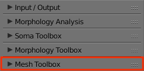
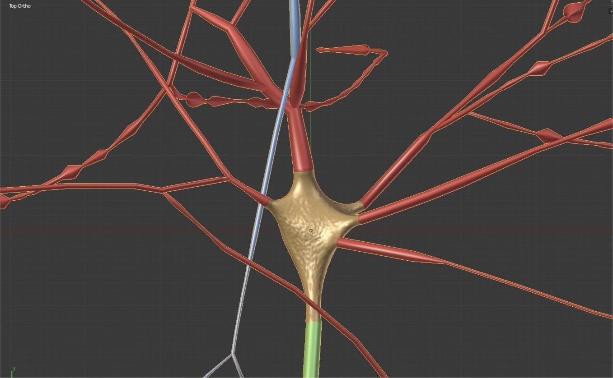
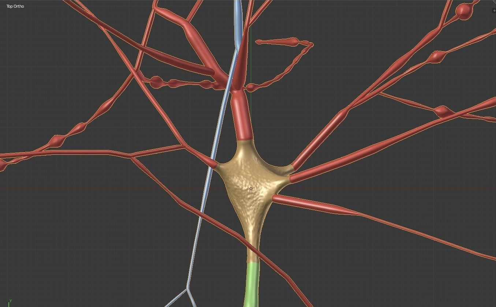
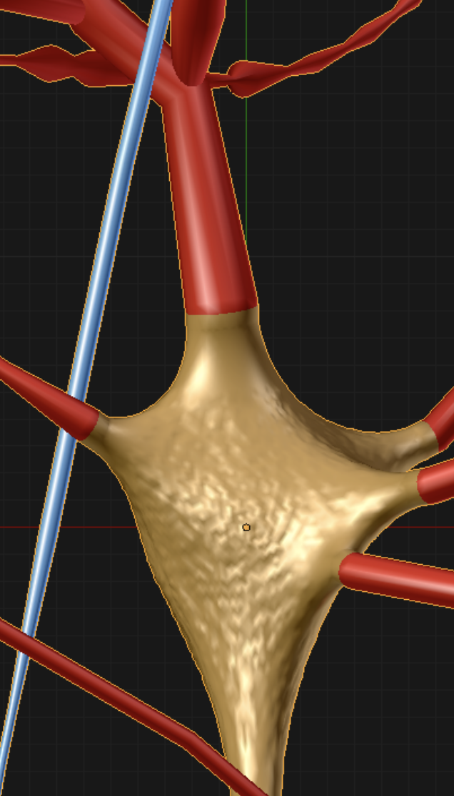
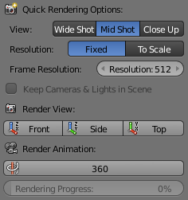
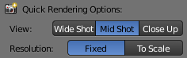
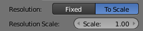
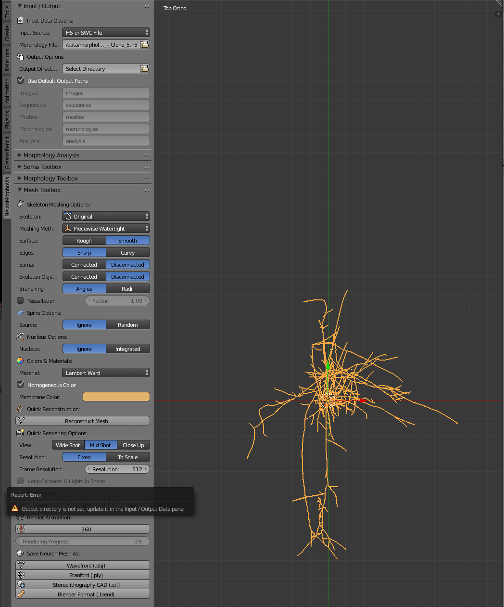
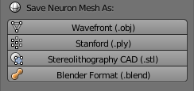

# Mesh Toolbox Panel

  

## Summary
This panel gives access to the parameters of the __Meshing__ toolbox. This toolbox is used to reconstruct polygonal mesh models from morphological skeletons.

## Expected Output 
The current version of NeuroMorphoVis implements the __piecewise-watertight meshing__ algorithm that is proposed by [Abdellah et al, 2017](https://bmcbioinformatics.biomedcentral.com/articles/10.1186/s12859-017-1788-4). This method reconstructs a single mesh object that is composed of a set of watertight meshes, each corresponding to an individual component in the original morphology skeleton. For example, breadth-first traversal is used to connect and construct primary sections along each arbor in the form of tubes. These tubes are converted into watertight meshes that by definition have non manifold edges or vertices. The grouping of the reconstructed meshes results in the final mesh object that is not watertight per se, but rather piecewise-watertight.          

## Panel Description & Options

Once all the meshing parameters are set, a neuronal mesh can be reconstructed by clicking on the button __Reconstruct Mesh__. Once the mesh is reconstructed, it will appear in the principal three-dimensional widget of Blender. The mesh can be then rendered and saved as a .png image by clicking on the different views buttons: __Front__, __Side__, or __Top__. We can also render a 360 movie of the reconstructed mesh by clicking on the __360__ button. Finally, the mesh can be exported to different file formats such as __.obj__, __.ply__, __.stl__ and __.blend__ meshes.

### Meshing Methods
The current version of NeuroMorphoVis provides only the __Piecewise Watertight__ meshing method for reconstructing polygonal surface meshes from input morphological skeletons. We have already implemented other meshing techniques, but their stability is still questionable. These techniques will be integrated in NeuroMorphoVis in future releases. 

### Skeleton 

It is quite known that the reconstructed morphological skeleton comes with 

+ __Original__ Use the original skeleton of the morphology as given in the input morphology. 
+ __Tapered__ Taper the sections by making the radius each section gradually descreasing. 
+ __Zigzag__ Add an artificial zigzagged noise or wiggles that are caused by the staining procedures.
+ __Tapered Zigzag__ Taper the sections and also add wiggles with random shifts. 

### Surface 
The surface of the mesh that reflects that membrane of a neuron can be __Smooth__ or __Rough__. 
+ __Smooth__ This options is quite often used to render nice morphologies that can be used for illustrative purposes.
+ __Rough__ The roughness addedd to the surface of the mesh makes the neuron mesh more realistic as seen under the microscope. This option is used for meshes created mainly for performing in silico imaging experiments. 

### Edges

Due to manual tracing artifacts, neuronal morphology skeletons are normally reconstructed with sharp edges between the different samples. This issue reduces the realism of the generated meshes, in particular when the meshes are used to create close up renderings. To remove these artifacts, we introduced an option to apply a vertex smoothing filter that smooths the hard edges while preserving the geometry and topology the morphology skeleton.

The edges can be _Sharp_ or _Curvy_.

+ __Sharp__
Preserve the angles between the edges. 

+ __Curvy__ 
Apply vertex smoothing filter to the reconstructed mesh to make the edges look curvy and realistic.

<table>
  <tr>
    <th> Sharp Edges </th>
    <th> Curvy Edges </th>
  </tr>
  <tr>
    <td>  </td>
    <td>  </td>
  </tr>
</table>

  
   

### Soma Connectivity to Branches

+ __Connected__
+ __Disconnected__

  
   

### Skeleton Objects 
+ __Connected__
+ __Disconnected__

### Branching 
+ __Angles__
+ __Radii__

   
  

### Tessellation 

### Colors & Materials 
#### Homogeneous Color 

+ __Soma Color__: The color of the soma mesh.
+ __Axon Color__: The color of the axon mesh.
+ __Basal Dendrites Color__: The color of the basal dendrites meshes. 
+ __Apical Dendrite Color__: The color of the apical dendrites meshes.
+ __Spines Color__: The color of the spine meshes. 

### Material 
+ __Flat__
+ __Lambert Ward__
+ __Super Electron Light__
+ __Super Electron Dark__
+ __Electron Light__
+ __Electron Dark__
+ __Glossy Bumpy__
+ __Shadow__

### Rendering Meshes 
Rendering the mesh requires some work to setup the lighting and camera and locate them properly in the scene. We have added support to automate all of that with a single click. 

  

#### Rendering View 

To understand the difference between the different shots in general, you can refer to this [artlcie](https://www.bhphotovideo.com/explora/video/tips-and-solutions/filmmaking-101-camera-shot-types). 

+ __Wide Shot__ The spatial extent of a wide shot image spans that of the entire morphology, even if we limit the branching order to certain level. To render a wide shot view of the mesh, the option _Wide Shot_ must be selected before clicking on any rendering button. 

  

+ __Mid Shot__ The spatial extent of a mid shot image is limited to the bounding box of _only_ the arbors reconstructed at a specific branching order. To render a mid shot view of the mesh, the option _Mid Shot_ must be selected before clicking on any rendering button. 

  

+ __Close Up__ If you select to render a closeup view of the mesh by clicking on the _Close Up_ button, then you can set the size of the closeup shot in the _Close Up Size_ field. 

  

#### Rendering Resolution
NeuroMorphoVis has added support to set the resolution of the rendered images either to a _fixed_ resolution or based on the _dimensions of the morphology skeleton_. The later option is mandatory for the images that are required for scientific articles or publications. It allows the user to rendering images _to scale_ and overlay a scale bar on the top of the image. 

+ __Fixed__ The resolution of the image is normally defined by two parameters (width and height) in pixels, however, NeuroMorphoVis forces the users to define the resolution of the image using a single parameter to avoid rendering a distorted image.  
 
+ __To Scale__ Before rendering the reconstructed mesh into an image, the three-dimensional bounding box (width, height and depth) of the mesh is automatically computed and the resolution of the image is defined based on _1) the bounding box of the mesh_ and _2) the rendering view_. For example if the bounding box of the mesh is 100 x 200 x 300 and a front view is rendered, then the resolution of the image will be set automatically set to 100 x 200. If the side view of the mesh is rendered, then the resolution of the image will be set to 200 x 300 and finally if the top view is rendered, then the resolution of the image will be set to 300 x 100. If the user wants to render an image to scale, then option _To Scale_ must be selected. In this case, each pixel will correspond in the image to 1 micron, and the resolution of the image is limited to the dimensions of the morphology. To render higher resolution images, however to scale, we have addedd support to scale the resolution of the image using a scale factor that is defined by the user. When the user select the _To Scale_ option, the _Scale Factor_ slider appears below to give the user the control to select the most approriate scale factor that fits the objective ultimate objectives of the image. By default, the scale factor is set to 1. Note that increasing the scale factor will make the rendering process taking longer _O(NXM)_. A convenient range for the scale factor is 3-5.    

  

#### Rendering View 
After setting all the rendering parameters as shown in the previous steps, the users can render an image of the mesh using any of the following buttons:

+ __Front__ 
This button renders the _front_ view of the reconstructed mesh. 

+ __Side__ 
This button render the _side_ view of the reconstructed mesh.

+ __Top__ 
This button renders the _top_ view of the reconstructed mesh. 

  

  
The rendered images will be generated in the _images_ directory underneath the output directory that is set by the user in the Input / Output panel. If this path is not set, the user will get this error message __Output directory is not set, update it in the Input / Output Data panel__. In this case, the user must toggle the Input / Ouput panel and update the _Output Directory_ by replacing _Select Directory_ in the output options by an existing path on the file system. 

  

 
### Exporting Meshes 
The users can exploit the native support of Blender to export meshes into different file formats. But since we assumed that end users might not have any Blender experience, we have addedd four buttons to export the reconstructed meshes into the following common file formats:

+ __Wavefront (.obj)__ 
The OBJ file format is a simple data-format that represents 3D geometry alone — namely, the position of each vertex, the UV position of each texture coordinate vertex, vertex normals, and the faces that make each polygon defined as a list of vertices, and texture vertices. Further details about this file format can be found [here](https://en.wikipedia.org/wiki/PLY_(file_format)).

+ __Stanford (.ply)__ 
PLY is a file format known as the Polygon File Format or the Stanford Triangle Format. It was principally designed to store three-dimensional data from 3D scanners. The data storage format supports a relatively simple description of a single object as a list of nominally flat polygons. A variety of properties can be stored, including: color and transparency, surface normals, texture coordinates and data confidence values. The format permits one to have different properties for the front and back of a polygon.
Further details about this file format can be found [here](https://en.wikipedia.org/wiki/STL_(file_format)). 

+ __Stereolithography CAD (.stl)__ 
The STL file describes a raw, unstructured triangulated surface by the unit normal and vertices (ordered by the right-hand rule) of the triangles using a three-dimensional Cartesian coordinate system. Further details about this file format can be found [here](https://en.wikipedia.org/wiki/STL_(file_format)). 

+ __Blender Format (.blend)__ 
The exported file can be opened _only_ in Blender and can be used for rendereing purposes. 

  

 
The exported meshes will be generated in the _meshes_ directory underneath the output directory that is set by the user in the Input / Output panel. If this path is not set, the user will get this error message __Output directory is not set, update it in the Input / Output Data panel__. In this case, the user must toggle the Input / Ouput panel and update the _Output Directory_ by replacing _Select Directory_ in the output options by an existing path on the file system. 

  

 
