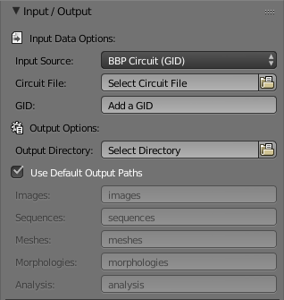

# Mesh Toolbox Panel

## Summary
This panel gives access to the parameters of the __Meshing__ toolbox. This toolbox is used to reconstruct polygonal mesh models from input morphological skeletons.

## Expected Output 
The current version of NeuroMorphoVis implements the __piecewise-watertight meshing__ algorithm that is proposed by [Abdellah et al, 2017](https://bmcbioinformatics.biomedcentral.com/articles/10.1186/s12859-017-1788-4). This method reconstructs a single mesh object that is composed of a set of watertight meshes, each corresponding to an individual component in the original morphology skeleton. For example, breadth-first traversal is used to connect and construct primary sections along each arbor in the form of tubes. These tubes are converted into watertight meshes that by definition have non manifold edges or vertices. The grouping of the reconstructed meshes results in the final mesh object that is not watertight per se, but rather piecewise-watertight.          

## Panel Description & Options

Once all the meshing parameters are set, a neuronal mesh can be reconstructed by clicking on the button __Reconstruct Mesh__. Once the mesh is reconstructed, it will appear in the principal three-dimensional widget of Blender. The mesh can be then rendered and saved as a .png image by clicking on the different views buttons: __Front__, __Side__, or __Top__. We can also render a 360 movie of the reconstructed mesh by clicking on the __360__ button. Finally, the mesh can be exported to different file formats such as __.obj__, __.ply__, __.stl__ and __.blend__ meshes.


### Meshing Methods
The current version of NeuroMorphoVis provides only the __Piecewise Watertight__ meshing method for reconstructing polygonal surface meshes from input morphological skeletons. We have already implemented other meshing techniques, but their stability is still questionable. These techniques will be integrated in NeuroMorphoVis in future releases. 

### Skeleton 


It is quite known that the reconstructed morphological skeleton comes with 

+ __Original__ Use the original skeleton of the morphology as given in the input morphology. 
+ __Tapered__ Taper the sections by making the radius each section gradually descreasing. 
+ __Zigzag__ Add an artificial zigzagged noise or wiggles that are caused by the staining procedures.
+ __Tapered Zigzag__ Taper the sections and also add wiggles with random shifts. 

### Surface 
The surface of the mesh that reflects that membrane of a neuron can be __Smooth__ or __Rough__. 
+ __Smooth__ This options is quite often used to render nice morphologies that can be used for illustrative purposes.
+ __Rough__ The roughness addedd to the surface of the mesh makes the neuron mesh more realistic as seen under the microscope. This option is used for meshes created mainly for performing in silico imaging experiments. 

### Edges
The edges can ve __Sharp__ or __Curvy__.
+ __Sharp__
+ __Curvy__ 

### Soma 
+ __Connected__
+ __Disconnected__

### Skeleton Objects 
+ __Connected__
+ __Disconnected__

### Branching 
+ __Angles__
+ __Radii__

### Tessellation 


### Colors & Materials 
#### Homogeneous Color 

+ __Soma Color__: The color of the soma mesh.
+ __Axon Color__: The color of the axon mesh.
+ __Basal Dendrites Color__: The color of the basal dendrites meshes. 
+ __Apical Dendrite Color__: The color of the apical dendrites meshes.
+ __Spines Color__: The color of the spine meshes. 

### Material 
+ __Flat__
+ __Lambert Ward__
+ __Super Electron Light__
+ __Super Electron Dark__
+ __Electron Light__
+ __Electron Dark__
+ __Glossy Bumpy__
+ __Shadow__

### Rendering Meshes 


#### Rendering View 

+ __Wide Shot__
+ __Mid Shot__
+ __Close Up__

#### Rendering Resolution
+ __Fixed__
+ __To Scale__

#### Rendering View 
+ __Front__
+ __Side__
+ __Top__


### Exporting Meshes 
The users can use the native support of Blender to export the meshes into different file formats. But since we assumed that the end user might not have any Blender experience, we have addedd four buttons to export the reconstructed meshes into the following common file formats
+ __.obj__
+ __.ply__
+ __.stl__
+ __.blend__


## Method 
NeuroMorphoVis has three methods to reconstruct different three-dimensional somata profiles:
+ __Profile__: This method uses only the profile points that are reported in the morphology files to reconstruct the soma from an ico-sphere, whose radius is set to the mean soma radius.   
<p align="center">
  
</p>

+ __Arbors__: This method uses the starting points of each root arbor to deform an ico-sphere. 
<p align="center">
  
</p>

+ __Complex__: This is a combined method of the two previous ones.
<p align="center">
  
</p>


### Input Source
+ The users can load morphologies from individual .SWC or .H5 files based on their absolute pathes in the file system. In this case, the __Input Source__ option should be set to __H5 or SWC File__, and the path to the morphology file should be set in the __Morphology File__ text box. You can also use the button on the right of the text box to open a file dialog and select the file from a specific path.

<p align="center">
  
</p>

+ The users can also load a morphology of a certain neuron reconstructed in a BBP circuit using its GID. In this case, the __Input Source__ option should be set to __BBP Circuit (GID)__, and then the path to the circuit configuration should be set in the __Circuit File__ text box (replace __Select Circuit File__ by the absolute path of the circuit, for example: /gpfs/WHATEVER_PROJECT/config.circuit) and the GID of the neuron should be set in the __GID__ field (replace __Add a GID__ by the GID of the neuron, for example: 1000).  

<p align="center">
  
</p>

### Output Options
NeuroMorphoVis can be only used to load and visualize morphologies. But if the users would like create any output, for example images, videos or meshes, then the __Output Directory__, where there artifacts will be generated, __must__ be set (replace __Select Directory__ by the absolute path of the output directory).

#### Output Tree
When the output directory is created, it automatically creates a list of subdirectories, each of them will contain a specific type of output. The default structure of the out directory is as follows 

```bash
OUTPUT_DIRECTORY
├── images
├── sequences
├── meshes
├── morphologies
├── analysis
```

If the user wants to change the name any of these subdirectories, then the checkbox __Use Default Output Paths__ must be unchecked. 

<p align="center">
  
</p>
