# Morphology Reconstruction Toolbox Panel

  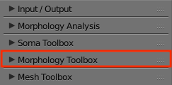

## Summary

This panel gives access to the parameters of the __Morphology Reconstruction Toolbox__. By reconstruction in the context, we mean generating a three-dimensional skeleton from a dendrogram (a tree diagram frequently used to illustrate the arrangement of the clusters produced by hierarchical clustering, for further details refer to this [link](https://en.wikipedia.org/wiki/Dendrogram)). 

### What is a Morphology Skeletion?

Neuronal morphologies are reconstructed from imaging stacks obtained from different microscopes. These morphologies can be digitized either with semi-automated or fully automated tracing methods. The digitization data can be stored in multiple file formats such as SWC and the Neurolucida proprietary formats. For convenience, the digitized data are loaded, converted and stored as a tree data structure (a data structure representing the dendrogram). 

### Morphology Components

The skeletal tree of a neuron is defined by the following components: a cell body (or soma), sample points, segments, sections, and branches. The soma, which is the root of the tree, is usually described by a point, a radius and a two-dimensional contour of its projection onto a plane or a three-dimensional one extracted from a series of parallel cross sections. Each sample represents a point in the morphology having a certain position and the radius of the corresponding cross section at this point. Two consecutive samples define a connected segment, whereas a section is identified by a series of non-bifurcating segments and a branch is defined by a linear concatenation of sections.  

Neuronal branches are, in general, classified based on their types into 
 
 + axons, 
 + apical dendrites and 
 + basal dendrites. 
 
### Important Note

Note that the three-dimensionap profile of the soma that is reconstructed in this skeleton -- if requested -- is based on the parameters set in the _Soma Toolbox panel_.

## Opening the Morphology Toolbox Panel

When you toggle (or click on) the _Morphology Toolbox_ tab highlighted in red above, the following panel, or a similar one depending on the version of NeuroMorphoVis, will appear.

  

In the following sections we will detail all the parameters shown in each section in this panel.
 
## Morphology Skeleton Parameters

In this section the user can select which components of the morphology skeletion will be reconstructed and generated in the scene.

### Soma 

The soma object can be _ignored_, represented symbolically by a _sphere_, or represented by an accurate _three-dimensional profile_ that can approximate its actual shape. 

  

The user can select one of the following options:

+ __Ignore__
The soma is totally ignored. 

  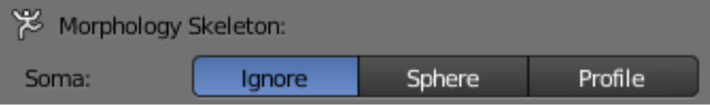

+ __Sphere__ 
The soma is symbolically represented by a sphere whose center is _usually_ set to the origin and radius is set to the mean radius reported in the morphology file. 

  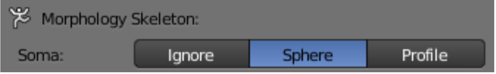

+ __Profile__ 
The soma is usually described in the morphology file by a point, a radius and a two-dimensional contour of its projection onto a plane. We use this data and reconstruct a three-dimensional profile of the soma using Hooke's law and the physics engine of Blender. If this option is selected, a realistic shape of the soma will be reconstructed and added to the scene.  Note that this profile is reconstructed based on the parameters set in the _Soma Toolbox panel_.

  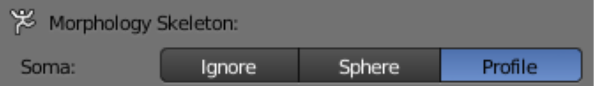

### Branches 

The user can add arbitrarly any branch of a specific type - if exists in the original morphology file - or remove it from the reconstructed skeleton. For example, in certain cases, the axon might not be that important to visualze. The user can remove the axon from the reconstructed object by unchecking the _Build Axon_ checkbox. 

  

The user can also select or highlight a specific branch type to visualize, for example basal dendrites. In this case the _Build Basal Dendrites_ checkbox must be checked and the _Build Axon_ and _Build Apical Dendrites_ checkboxes must be unchecked. 

  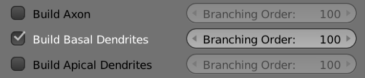

The maximum branching order of each type (axon, basal dendrite or apical dendrite) can be controled from the _Branch Order_ slider that corresponds to each branch type. For example, in the image below, the maximum branching order of the axon is set to 5, while the maximum branching orders of the apical and basal dendrites are set to 100. In general, setting the maximum branching order to 100 guarantees that all the branches will be reconstructed in the scene.  

  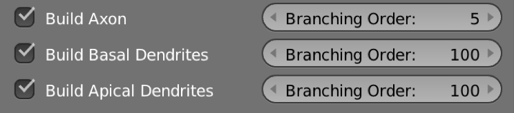

 
## Morphology Reconstruction Parameters
  
### Reconstruction Method

### Skeleton Style 

  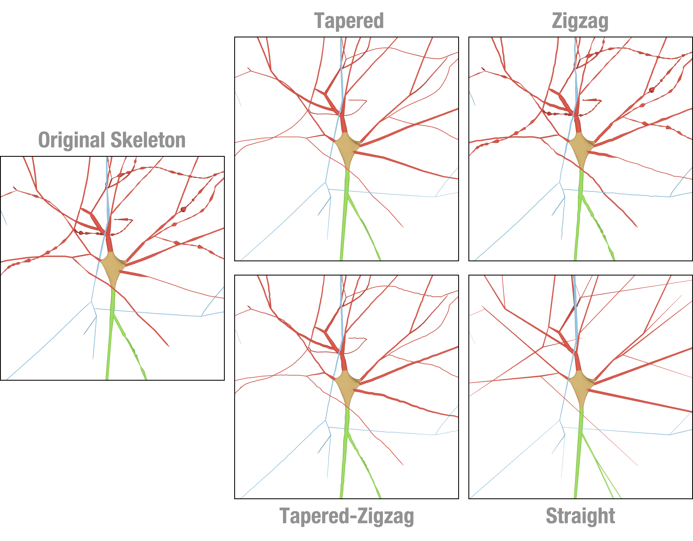

### Branching 

+ __Radii__
This option is the default. 

  

 
+ __Angles__  

  

  

### Arbor Quality 

### Sections Radii 

  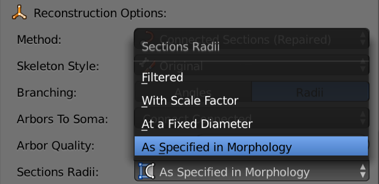

+ __As Specified in Morphology__
The morphology skeleton is reconstructed using the radii specified in the morphology file. _NeuroMorphoVis_ does not apply any pre-processing kernels to change the radii of the samples. In certain cases, some branches - for example the axons - are extremely thin to be seen in the rendering. If the user is interested to visualizae the structure of the entire skeleton in focus, the following two options can be alternatively used.   

+ __At a Fixed Diamater__
The user can change the radius of all the sections of the morphology from the _Fixed Radius Value_ slider. 
  

  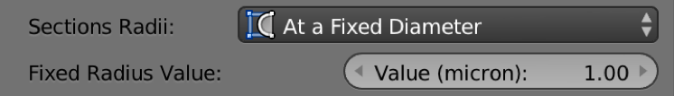

  

+ __With Scale Factor__
To preserve the respective scales of the sections across the morphology skeleton, NeuroMorphoVis has added support to scale the radii of the sections.
The user can change the scale factor of the radii from the _Radius Scale Factor_ slider. 
  

  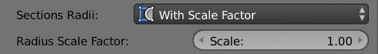

  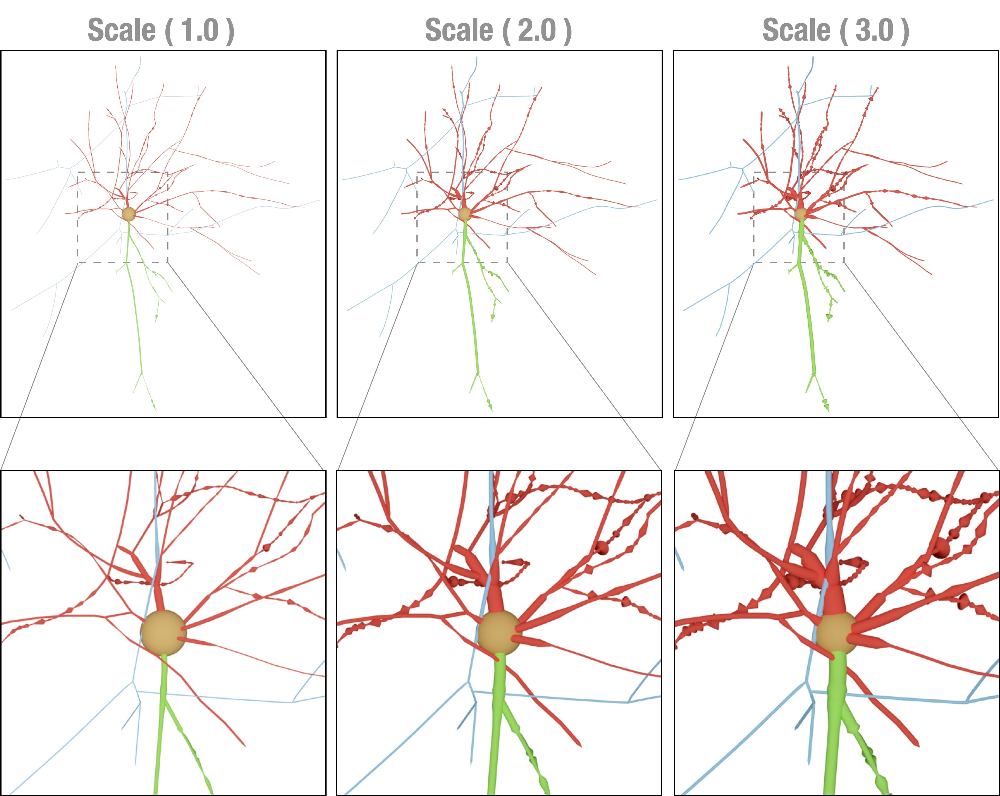

## Morphology Colors and Shading Parameters

  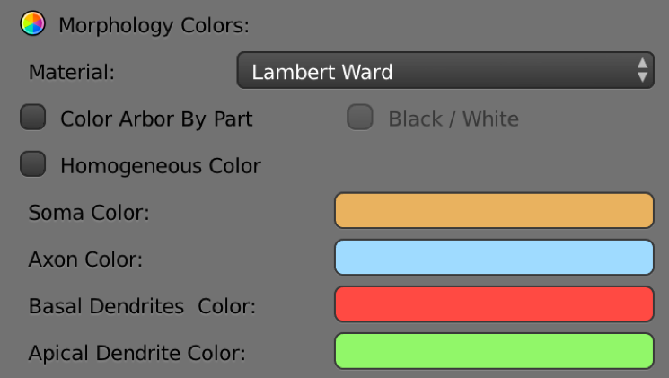

### Selecting Material 

+ __Lambert Ward__ 
+ __Flat__
+ __Electron Light__
+ __Electron Dark__
+ __Super Electron Light__
+ __Super Electron Dark__
+ __Glossy__
+ __Shadow__

  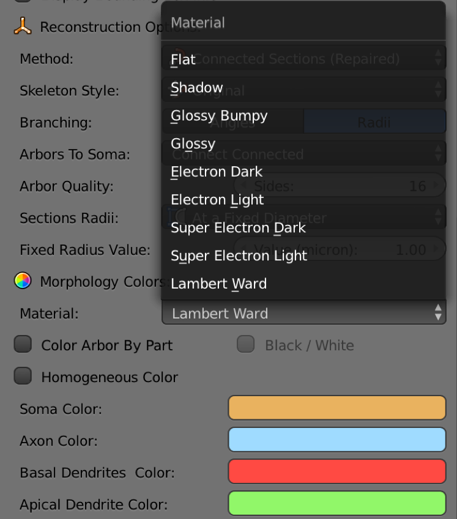

  

### Color Scheme 

  

#### Color Arbor by Part

  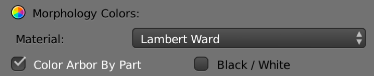

#### Black White 

  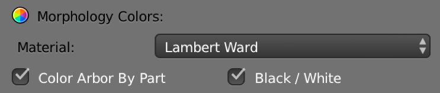

#### Homogeneous Color

  

  

## Let's Reconstruct the Morphology 

  

## Rendering Parameters 

### Rendering View 

+ __Wide Shot__

  

+ __Mid Shot__

  

+ __Close Up__

  

### Resolution 

+ __Fixed Resolution__

+ __To Scale__

## Let's Render the Morphology

### Rendering an Image

After setting all the rendering parameters as shown in the previous steps, the users can render an image of the morphology using any of the following buttons:

+ __Front__
This button renders the front view of the reconstructed morphology.

+ __Side__
This button render the side view of the reconstructed morphology.

+ __Top__ 
This button renders the top view of the reconstructed morphology.

  

### Rendering a Movie

NeuroMorphoVis has added support to render two types of movies: _360_ and _Progressive_ sequence. 

+ __360__
The user can render a 360 movie to visualize the morphology from the different views.

+ __Progressive__  
The user can render a progressive animation showing the progressive reconstruction (or the growth) of the morphology. The resulting movie depends on the method used to reconstruct the morphology. 

  

## Morphology Export 

The current version of NeuroMorphoVis supports exporting the reconstructed morphology into _.blend_ file.  

+ __Export as a Blender File__
To export the morphology into a _.blend_ file, click on the _Blender Format (.blend)_ button under the _Save Morphology As_ section.

  

| A | B | C | D | E | F | G |
|:-:|:-:|:-:|:-:|:-:|:-:|:-:|
|   |   | 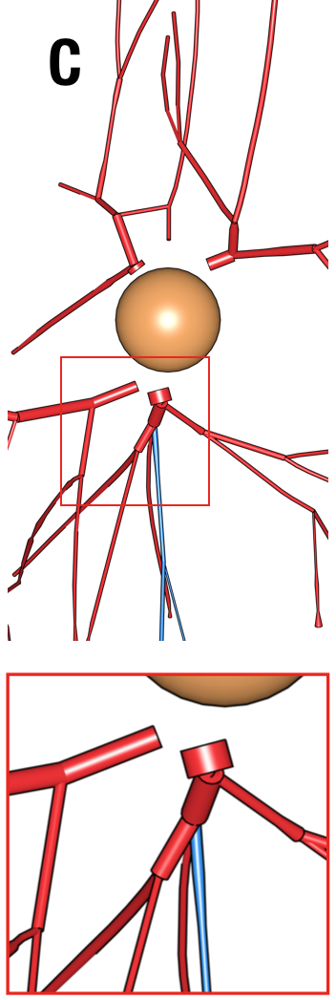|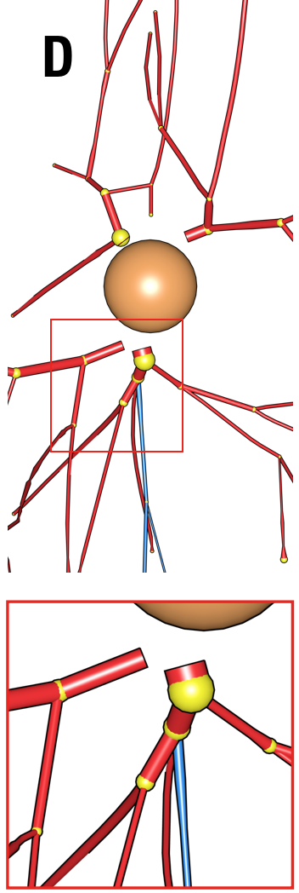| |  |  |
